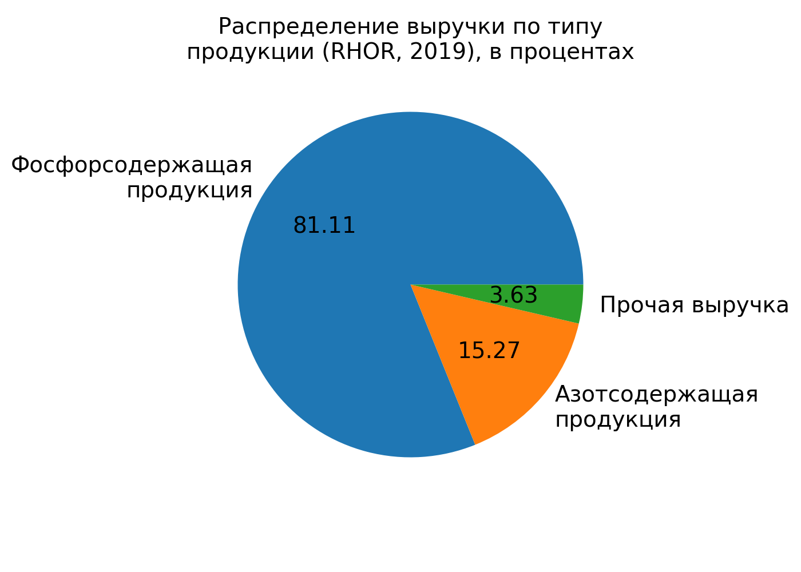

**Химическая промышленность / [ФосАгро](https://www.phosagro.ru/) (PHOR)**

ФосАгро – российская вертикально-интегрированная компания, один из ведущих мировых производителей фосфорсодержащих удобрений.

## Динамика выручки, капитала, обязательств, активов

Выручка за 5 лет выросла, значит бизнес растёт и больше продаёт год за годом.
Также растут активы, что видно на рисунке ниже, что также говорит о росте бизнеса.

Теперь смотрим на динамику чистой прибыли за последние 5 лет.

Чистая прибыль не растёт, несмотря на рост бизнеса. Некруто.
Особенное снижение в 2017 году.
В отчёте за 2017 год указано, что снижение чистой прибыли обусловлено укреплением рубля в этом году.

Соотношение валовой прибыли к себестоимости упало за последние пять лет, что не очень здорово, но возможно из-за этого при увеличении выручки чистая прибыль не растёт.

Теперь посмотрю детальнее на выручку

Как и ожидалось, основная выручка идёт из продаж фосфорсодержащей продукции, в которую входит куча разных наименований.
Также на диаграмме видим приличную долю экспорта (исключая страны СНГ), которая достигает 60%. Здорово.

## Дополнительные факторы

1. *Рыночный риск*
    (Колебания валюты могут повлиять на прибыль --> производится политика хэджирования)
    
1. *Сезонность бизнеса*
    (Спрос на продукцию колеблется в течение года --> компания продаёт продукцию в разных регионах)

## Дивидендная политика

Совет директоров стремится к тому, чтобы сумма средств, направляемых на выплату дивидендов, составила от 50% до более чем 75% от  консолидированного  свободного  денежного  потока  компании  за соответствующий период по МСФО

Компания постоянно платит дивиденды, что радует, процент даже выше, чем текущие ставки депозитов в банках.

## ROA

Отвечает на вопрос, выгоднее ли "владельцу" всё продать и положить деньги на депозит?

Высокий показатель ROA относительно среднего по отрасли 5.04 согласно MSN финансы), здорово.
Управляют организацией хорошо

## Оценка компании

Теперь, пользуясь мультипликаторами, можно попробовать проверить, недооценена или переоценена компания на бирже

### Капитализация PHOR

### P/E
Через сколько лет окупится инвестиция, если прибыль останется на том же уровне и всю прибыль руководство направит на дивиденды

Довольно большое значение, но возможно нормальное для данной отрасли, поэтому нужно посмотреть другие компании оттуда

### P/S
Отношение рыночной капитализации компании к её годовой выручке. 
Показатель <1 может говорить о недооценённости компании

P/S соответствует среднему по отрасли 1.42 (MSN финансы)

### EV/EBITDA

Довольно большой показатель, но опять же возможно из-за специфики бизнеса, поэтому нужно понять, что там у конкурентов

### Долг/EBITDA

## Планы на будущее

1. Развитие мощностей в Череповеце (2019-2020) - больше аммиачной селитры, серной кислоты, сульфата аммония, пропускной способности ж/д
Прогноз: 60+ млн $ к EBITDA
1. Развитие Волховской площадки (2021) - ещё больше удобрений для экспорта.
Прогноз: 90+ млн $ к EBITDA
1. Развитие Балаковской площадки (2022) - ещё больше удобрений для экспорта.
Прогноз: 50+ млн $ к EBITDA

## Вывод

У компании ФосАгро растёт выручка, она наращивает капитал, при этом стабильно платит дивиденды.

Обладает преимуществом производства в России и экспорта в Европу.

Но пока что кажется, что стоимость её акций не увеличится, но зато, как уже говорилось, компания стабильно выплачивает дивиденды.
