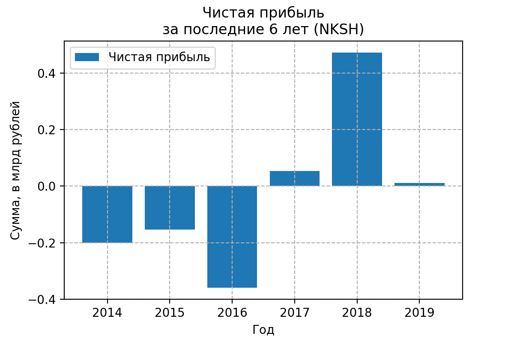

**Химическая промышленность / [Нижнекамскшина](https://shinakama.tatneft.ru) (NKSH)**

> Крупнейшее предприятие шинной промышленности Российской Федерации, в числе лидеров среди производителей легковых и легкогрузовых шин в странах СНГ. <...> ПАО «Нижнекамскшина» стал первым поставщиком на российском рынке, который омологировал шины на автомобильные заводы таких крупнейших иностранных автопроизводителей, как Fiat, Volkswagen, Skoda и Ford. (*оф. сайт Нижнекамскшина*)

## Динамика выручки, капитала, обязательств, активов

Выручка росла до 2018 года, в 2019 году падение.
Сама компания не растёт.

Видим довольно большую долю обязательств в активах. 
Последние годы прослеживается тренд на увеличение доли капитала, но пока всё равно страшно

Теперь смотрим на зависимость чистой прибыли

Выглядит неважно. Чего нет, того нет.

Соотношение валовой прибыли к себестоимости совершенно низкое: грубо говоря, делают продукт за рубль, а продают за рубль десять.

Кажется понятно, что сюда не нужно вкладывать деньги

Выглядит всё это печально, поэтому посмотрю [коэффициент текущей ликвидности](https://journal.tinkoff.ru/wiki/likvidnost/) - показывает, как компания может погашать текущие обязательства за счет только оборотных активов.
Чем выше коэффициент, тем выше платежеспособность предприятия. Если этот показатель ниже 1.5, значит, предприятие не в состоянии вовремя оплачивать все счета.

Ещё раз, в норме данный коэффициент должен лежать между 1.5 и 2.5, здесь 0.2. Нехорошо.
Всё, видимо можно заканчивать

## Дивидендная политика

Но может быть дивиденды большие, проверим.

> На  существующем  этапе  развития  основной  деятельности  дивидендная  политика  Общества  предусматривает  **направление  всей  прибыли  на  погашение  убытков  прошлых  лет**.  Однако  в  среднесрочной  перспективе  не  исключено,  что  акционеры  пересмотрят  дивидендную политику. (*из [годового отчёта 2019](https://shinakama.tatneft.ru/upload/files/%D0%93%D0%BE%D0%B4%D0%BE%D0%B2%D0%BE%D0%B9%20%D0%BE%D1%82%D1%87%D0%B5%D1%82%20%D0%9F%D0%90%D0%9E%20%D0%9D%D0%B8%D0%B6%D0%BD%D0%B5%D0%BA%D0%B0%D0%BC%D1%81%D0%BA%D1%88%D0%B8%D0%BD%D0%B0%20%D0%B7%D0%B0%202019%20%D0%B3%D0%BE%D0%B4.pdf)*)

**Ноль** рублей за последние 6 лет было выплачено на дивиденды.

## ROA

Отвечает на вопрос, выгоднее ли "владельцу" всё продать и положить деньги на депозит?

Кажется выгоднее кинуть денежку в банк.

## Оценка компании

Видим, что бизнес мягко говоря не идеальный. Но ведь даже такая компания может быть недооценённой.
Теперь, пользуясь мультипликаторами, можно попробовать проверить, недооценена или переоценена компания на бирже

### Капитализация PHOR

Капитализация в 2019 году подскочила, возможно это связано с их отличными покателями в 2018 году

### P/E
Через сколько лет окупится инвестиция, если прибыль останется на том же уровне и всю прибыль руководство направит на дивиденды

В 2019 году компанию сильно переоценили. Я бы не взял.

### P/S
Отношение рыночной капитализации компании к её годовой выручке. 
Показатель <1 может говорить о недооценённости компании

Так, нашёл единственный показатель, согласно которому компанию надо срочно брать

## Вывод
Показатели оставляют желать лучшего, сейчас даже не буду рассматривать к покупке.
Когда станет лучше, тогда и посмотрим.