**Химическая промышленность / [ВХЗ](https://www.vhz.su) (VLHZ)**

> Завод выпускает широкий ассортимент химической продукции: ПВХ-пластикаты, непластифицированныелистовые и гранулированные материалы, стеклопластиковые изделия – это основные группы продукции. Сфера применения их широка: от кабельной и автомобильной до пищевой и строительной отраслей.  (*оф. сайт ВХЗ*)

## Общие впечатления
Субъективные общие впечатления: сайт ужасен, в документах полнейший беспорядок, видимо им не особо нужны инвесторы.

## Динамика выручки, капитала, обязательств, активов

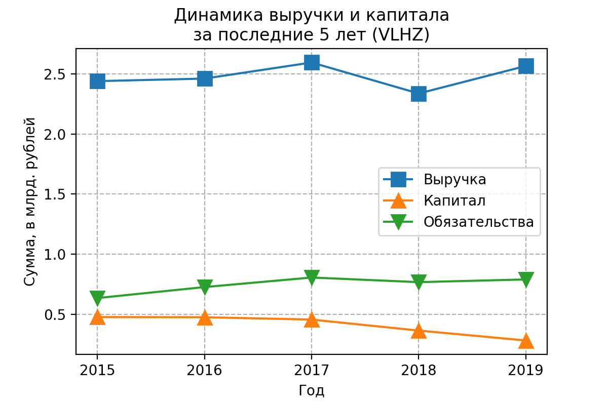
Выручка практически не меняется за пять последних лет.
Сама компания даже сокращает капитал.

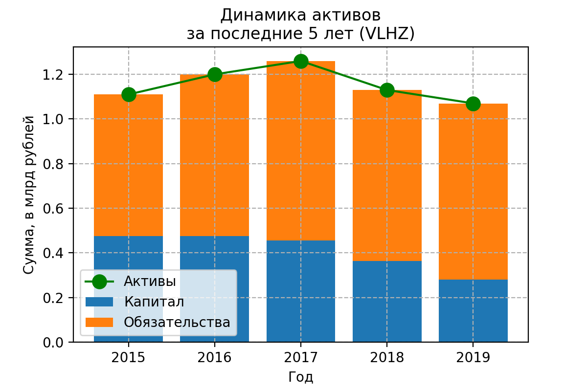
Здесь уже хорошо видно, как сокращаются активы в последние годы. 
К тому же в активах возрастает доля обязательств.
Похоже, что бизнес не развивается "вширь", но возможно как-то оптимизируются, посмотрим дальше.

Посмотрим на зависимость чистой прибыли
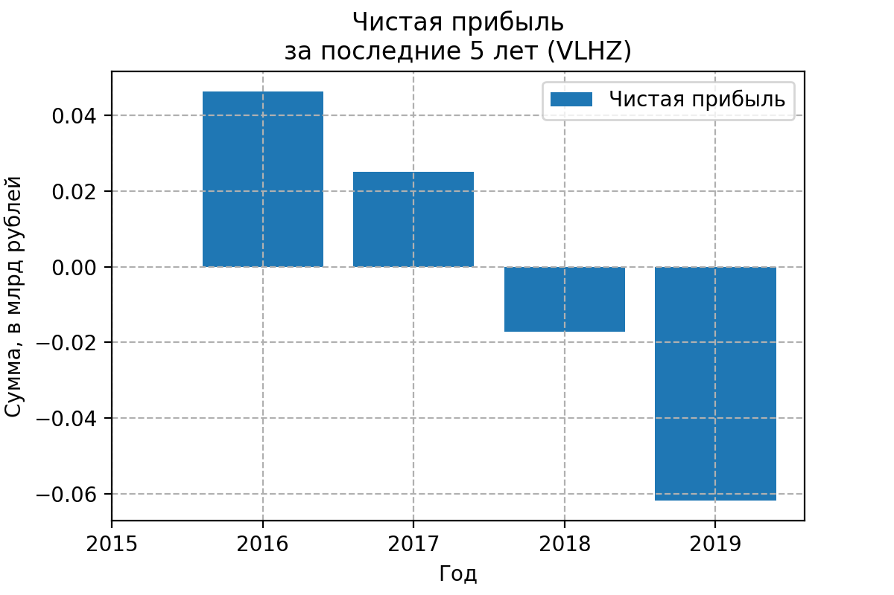
Прибыль падает, негативный тренд, аппроксимируется прямой здорово наверное.
Видимо никакой оптимизации нет, раз капитал падает, выручка не растёт и чистая прибыль тоже.

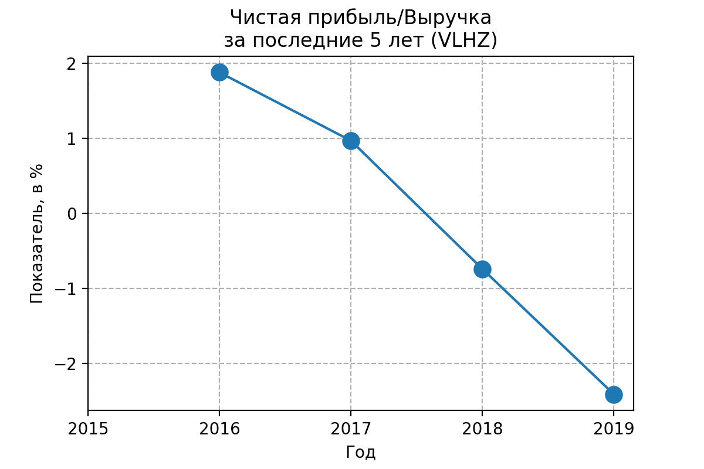
Показатель Чистая прибыль/Выручка показывает, что даже в лучшие годы компания выжимала 2% из выручки чистой прибыли, а теперь всё плохо.

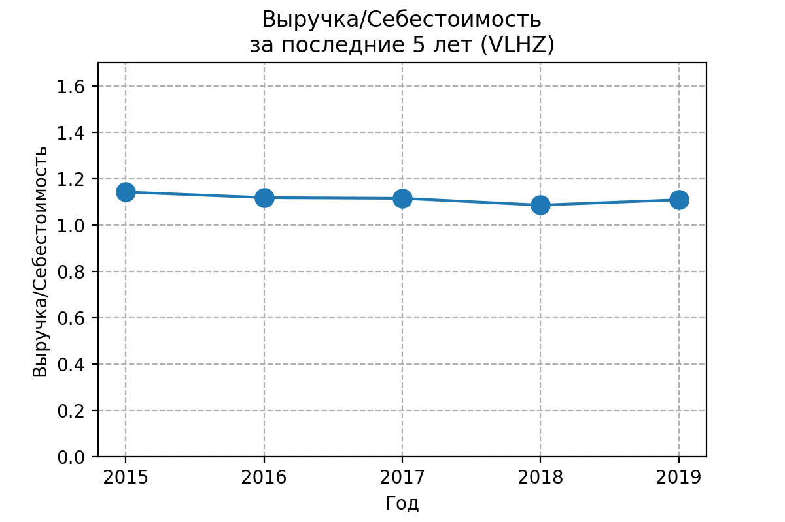
Ещё один показатель: Выручка/Себестоимость, есть ли у компании подушка, делают ли они деньги из ничего? 
Больше единицы, уже хорошо.

По новой традиции посмотрю коэффициент текущей ликвидности - показывает, как компания может погашать текущие обязательства за счет только оборотных активов.
Чем выше коэффициент, тем выше платежеспособность предприятия. Если этот показатель ниже 1.5, значит, предприятие не в состоянии вовремя оплачивать все счета.
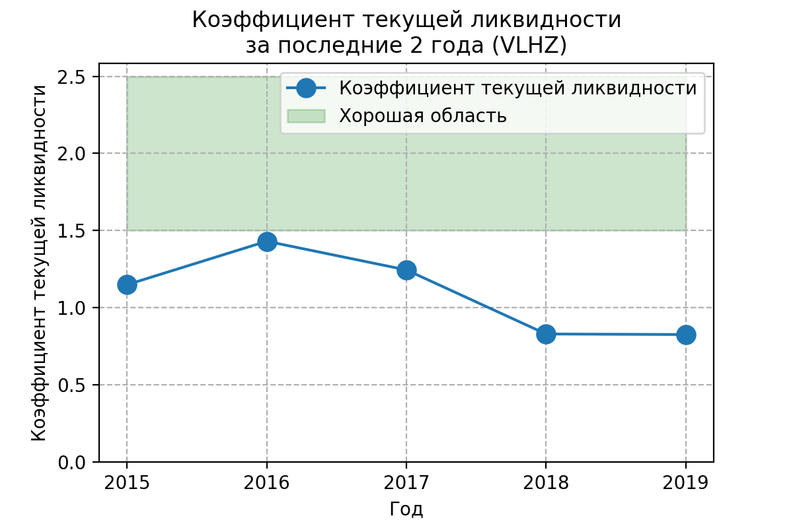
Коэффициент ниже нормы, но лучше чем у предыдущей компании "Нижнекамскшина", возможно такая специфика отрасли.

## Дивидендная политика

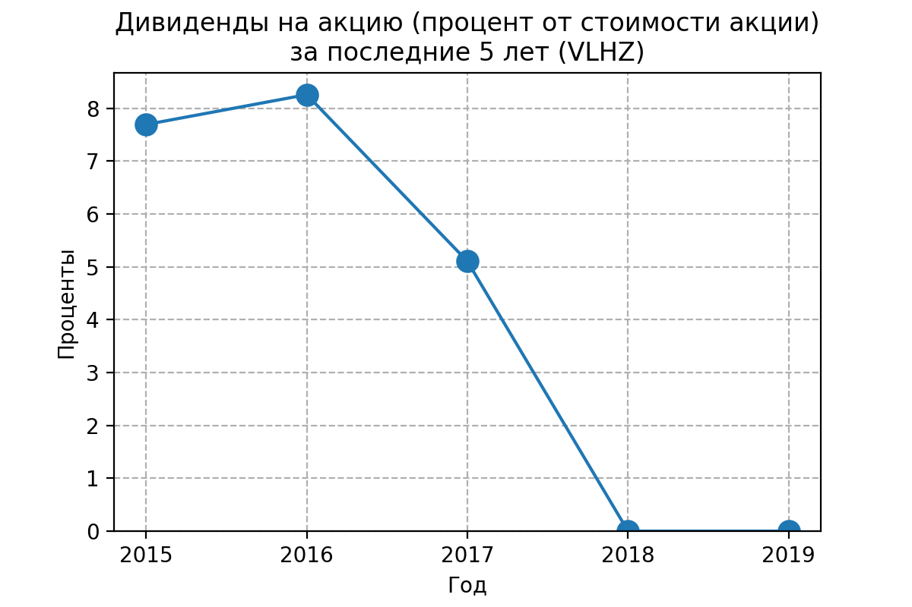
Так как последние годы есть только чистые убытки, то и дивидендов нет, а раньше платили прилично.

## ROA
Отвечает на вопрос, выгоднее ли "владельцу" всё продать и положить деньги на депозит?

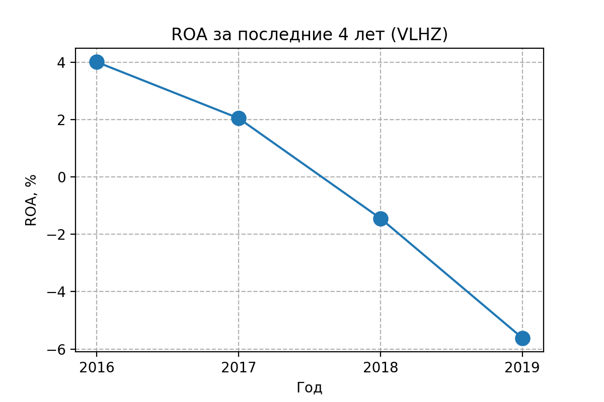
С учётом последних неудачных лет понятно, что показатель плох, но ведь даже в лучшие годы было не сказать, что феноменально, 4%.

## Оценка компании
Посмотрю мультипликаторы, больше для галочки

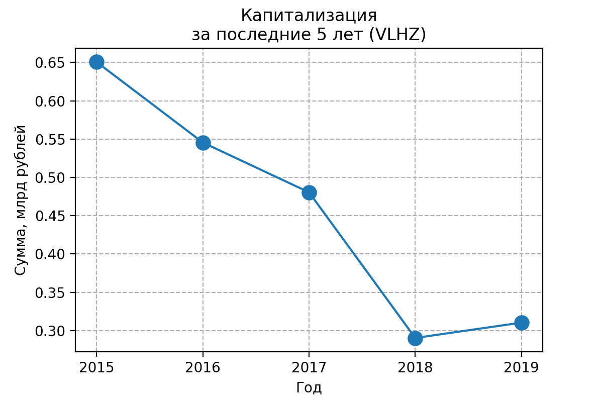
Капитализация падает последние годы, логично

### P/E
Через сколько лет окупится инвестиция, если прибыль останется на том же уровне и всю прибыль руководство направит на дивиденды

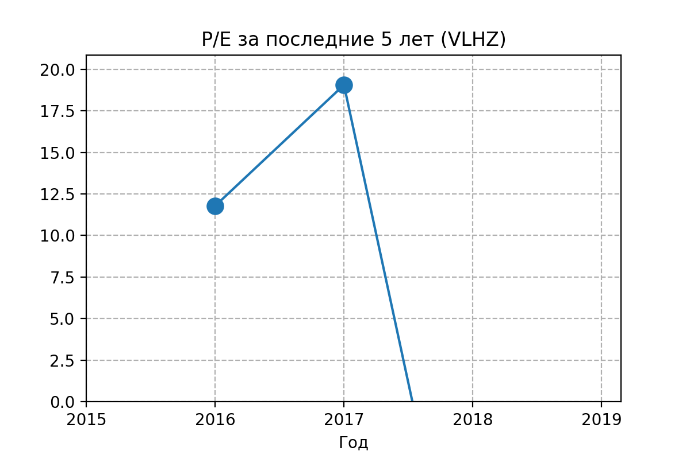

### P/S
Отношение рыночной капитализации компании к её годовой выручке. 
Показатель <1 может говорить о недооценённости компании
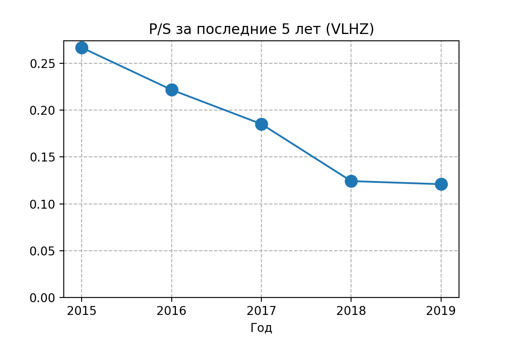
Как и во всех рассмотренных до этого компаниях. Видимо это специфика отрасли.

## Вывод
Я не возьму, выручка не растёт, капиталы падают, тренд на убыль чистой прибыли (на прибыток убытков :)
Да и остальные показатели не супер.
Сайт ужасен; отчёты тоже не блещут; красивых презентаций, чтоб я порадовался, нет.