**Химическая промышленность / [Химпром](https://www.himprom.com/) (HIMC[P])**

Химпром производит широкий ассортимент химической продукции:
**Дезинфицирующие средства**,
Неорганические продукты,
Органические продукты,
Фосфорорганические продукты,
Комплексоны,
ПАВ и технические моющие средства и т.д.

Кажется именно эта компания сможет извлечь наибольшую выгоду из коронавируса

## Динамика выручки, капитала, обязательств, активов

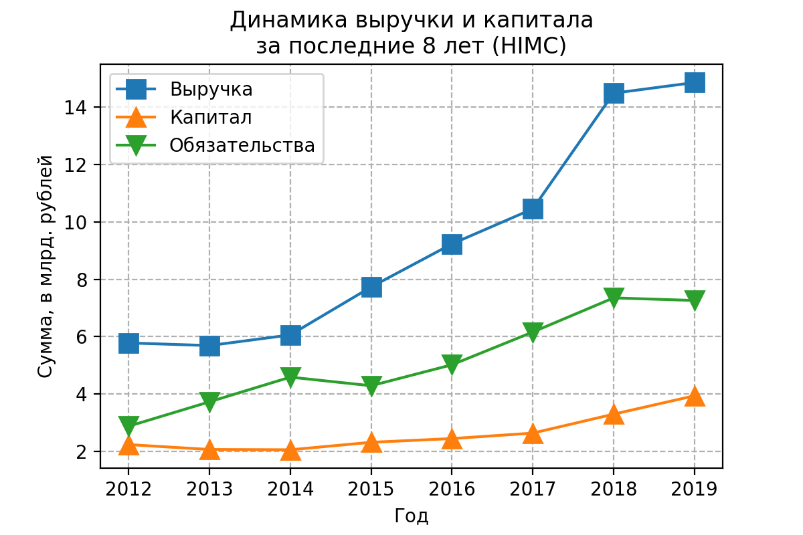
На графике видно, как выручка идёт вверх даже без коронавируса. Хорошо.

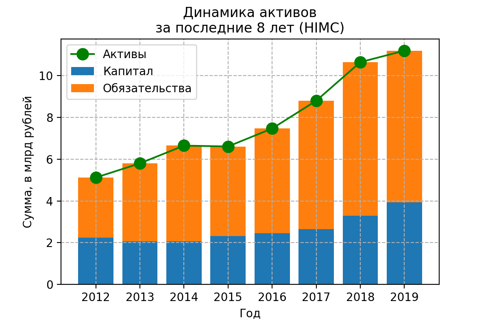
С активами тоже всё неплохо: компания растёт, особенно это заметно в последние годы. 
Возможно это связано с импортозамещением, государство поддерживает их и позволяет занимать рынок

## Чистая прибыль
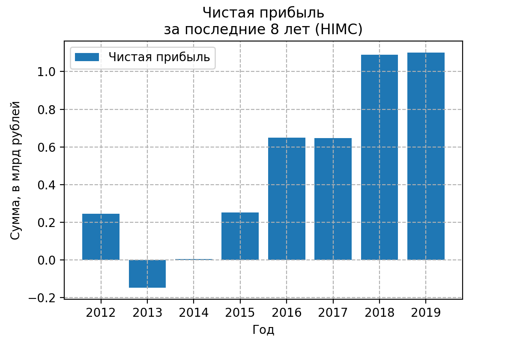
С чистой прибылью в последние годы тоже всё здорово, особенно в 2018 и 2019.

Возможно в 2020 будет пушка

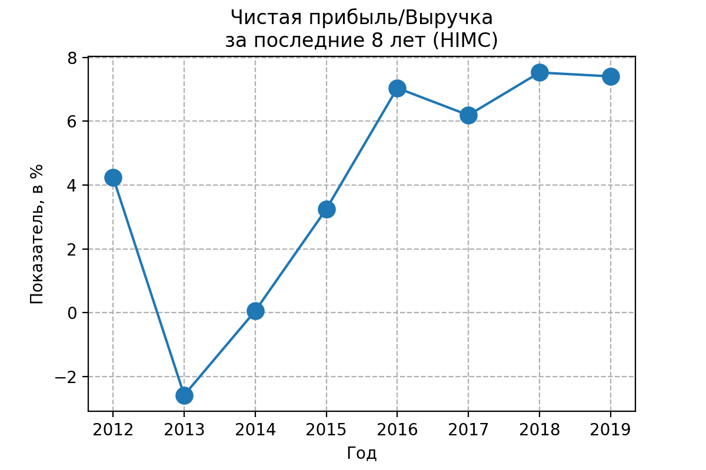
Хороший показатель Чистой прибыли к Выручке тоже радует

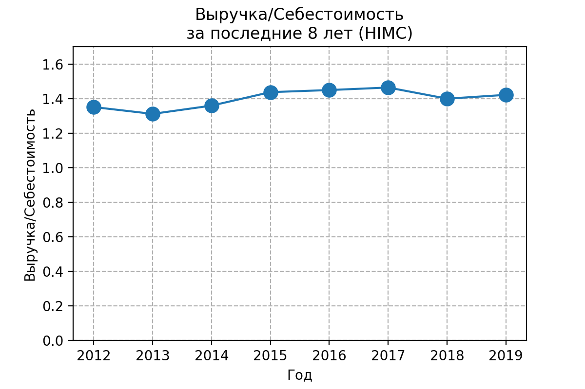
Хороший показатель Выручки к Себестоимости (что-то вроде добавленной стоимости + 1). В последние годы даже немного подрос

## Коэффициент текущей ликвидности
показывает, как компания может погашать текущие обязательства за счет только оборотных активов.
Чем выше коэффициент, тем выше платежеспособность предприятия. Если этот показатель ниже 1,5, значит, предприятие не в состоянии вовремя оплачивать все счета.
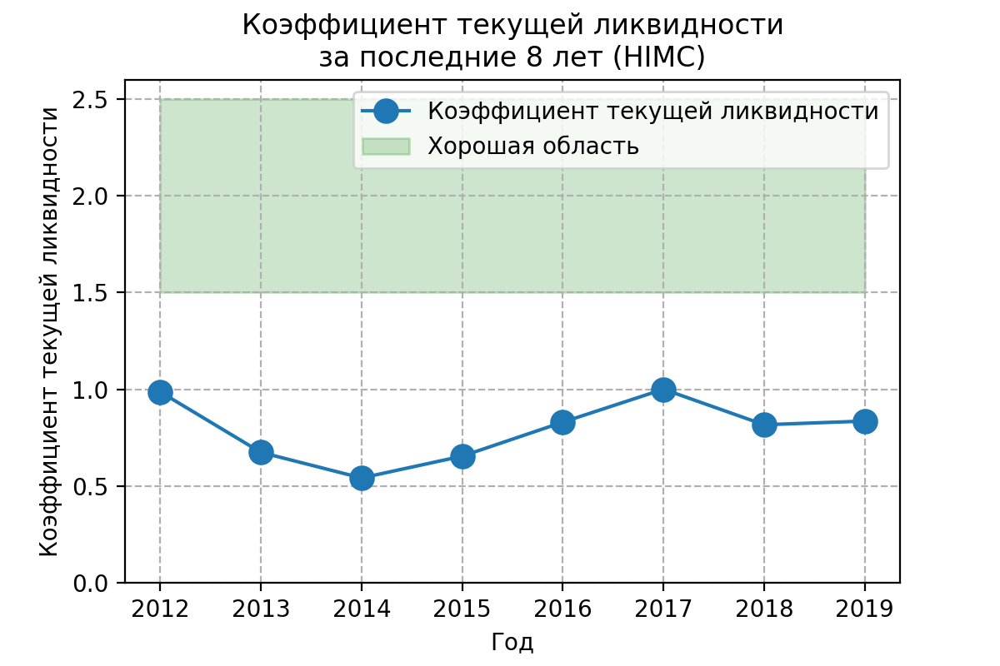
Этот показатель ниже идеального, но такая ситуация и у других компаний из этой отрасли, возможно это специфика

## Выручка
Теперь посмотрю детальнее на выручку

По сравнению с 2018 годом доля России в выручке возросла.
Видимо тренд на Россию будет продолжаться и дальше, тем более, что компания участвует в программе по импортозамещению и будет забирать рынок в России

Статистики по продажам разных видов продуктов не представлено в отчёте МСФО.

## Риски

1. *Кредитный риск* 
    (Химпром подвержен кредитному риску, т.к. никак не страхуется от него. "Все выданные займы не обеспечены имуществом, гарантиями и/или поручительствами и выданы компаниям, не имеющим официального кредитного рейтинга." *(из отчёта Химпром, МСФО 2019)*)
    
1. *Риск ликвидности*
    (Риск того, что у Химпрома возникнут сложности по выполнению фин. обязательств. Компания пытается держать необходимый уровень ликвидных средств)
    
* Компания не имеет полной страховой защиты своих производственных сооружений и прочего
* Компания опасается за правильный подсчёт налогов

## Дивидендная политика

На бирже торгуются привилегированные акции: у них нет права голоса по большинству вопросов, но зато они имеют право на дивиденды (максимум из: 10% чистой прибыли по РСБУ и дивидендов по обыкновенным акциям)
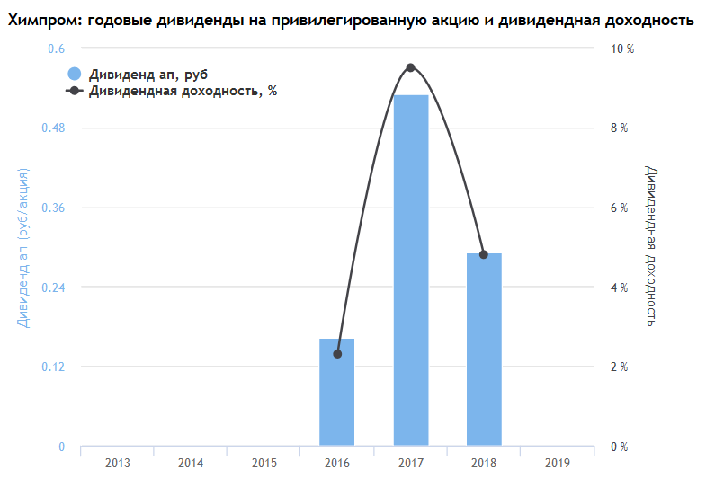
Взял данные со [смарт-лаба](https://smart-lab.ru/q/HIMC/dividend/)

## ROA
Отвечает на вопрос, выгоднее ли "владельцу" всё продать и положить деньги на депозит?
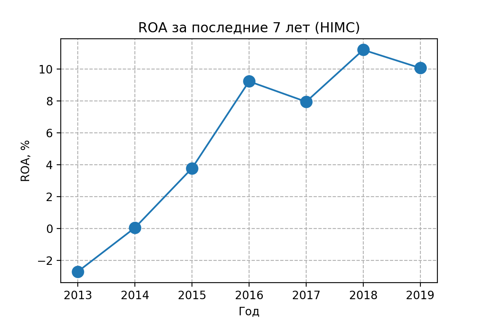
В последние годы всё стало слишком хорошо

## Оценка компании
Посмотрю мультипликаторы, больше для галочки

### Капитализация
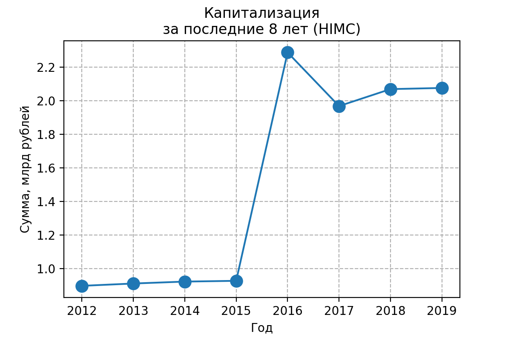
Капитализация падает последние годы, логично

### P/E
Через сколько лет окупится инвестиция, если прибыль останется на том же уровне и всю прибыль руководство направит на дивиденды
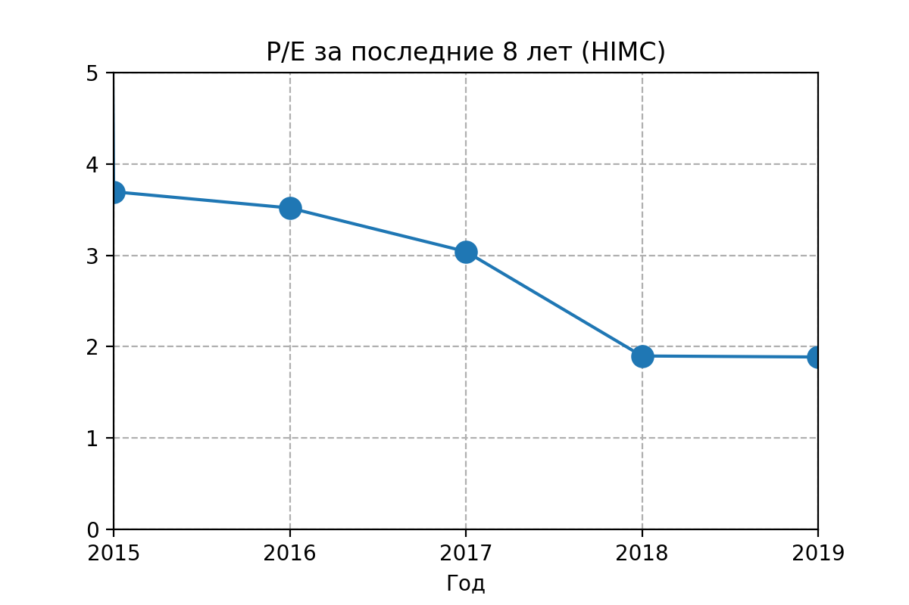
В последние годы P/E держится на довольно низком уровне, что хорошо

### P/S
Отношение рыночной капитализации компании к её годовой выручке. 
Показатель <1 может говорить о недооценённости компании
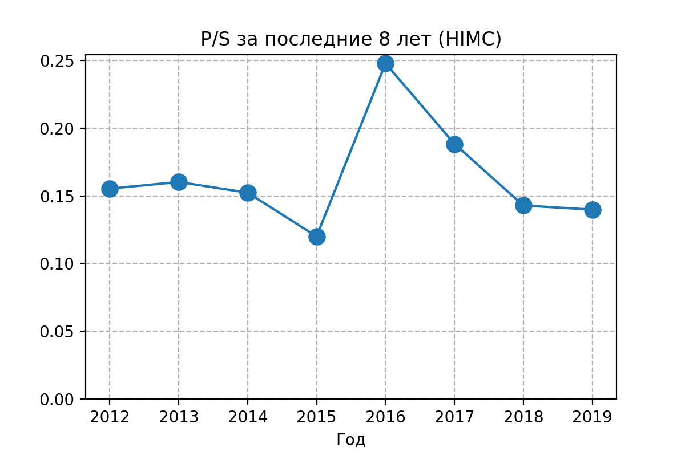

### EV/EBITDA Долг/EBITDA
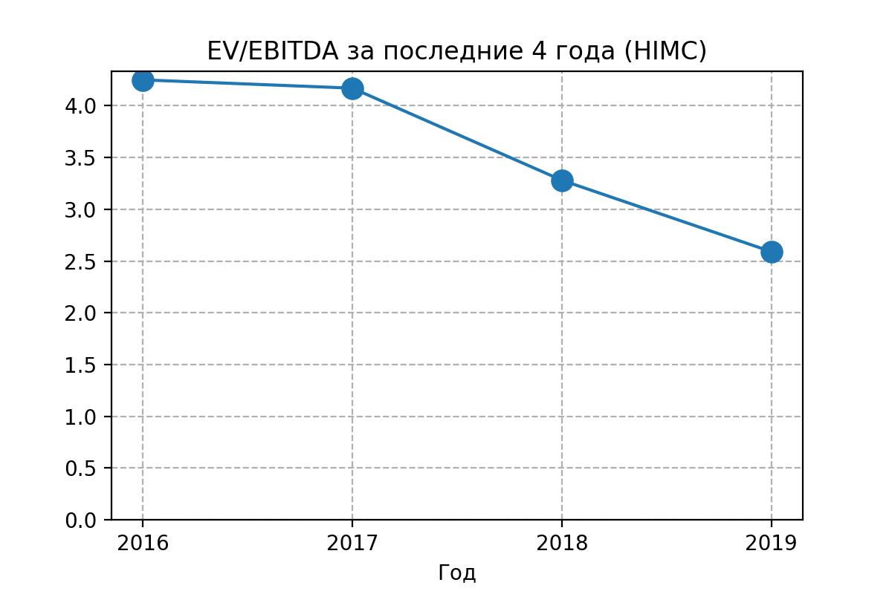
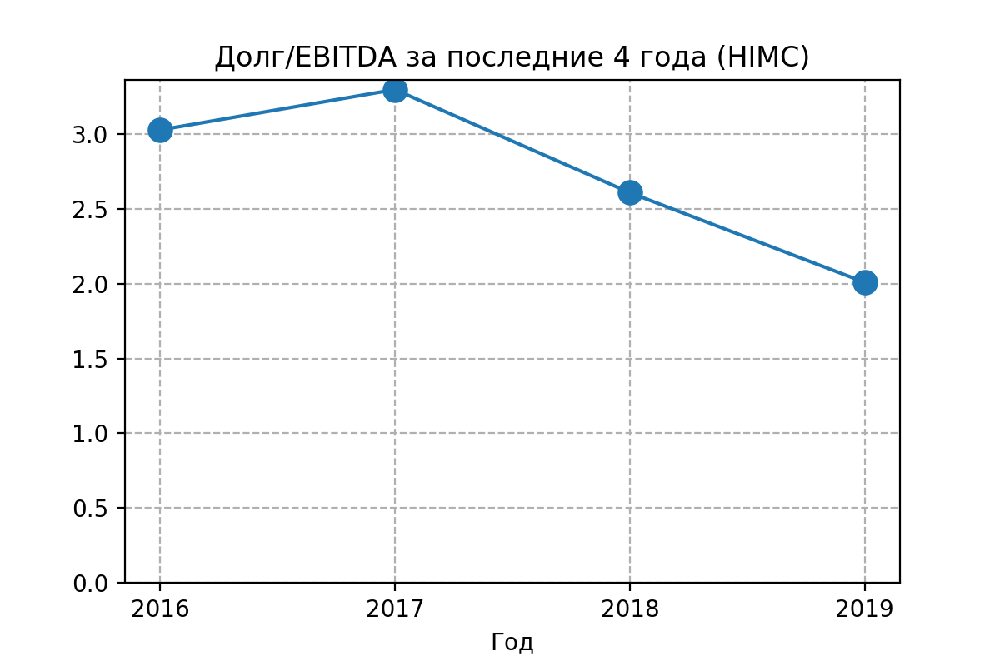

## [Планы](https://www.himprom.com/presscentr/news/11636/) на будущее

1. В 2019 построили единственное в РФ производство реагента для нейтрализации стоков процесса золотодобычи и водоподготовки
1. Реализуется (до 2022) создание нового производства пероксида водорода по антрахиноновой технологии мощностью 50 тысяч тонн в год
1. Несколько проектов по оптимизации затрат

## Вывод
Интересная компания с приличными показателями, может выиграть от коронавируса, есть над чем подумать