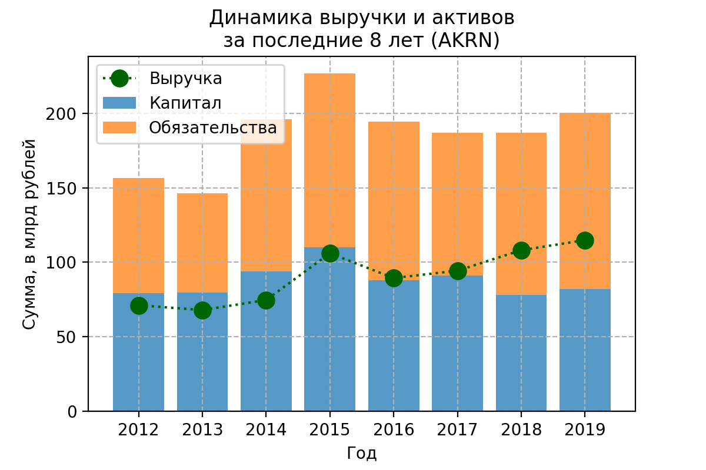
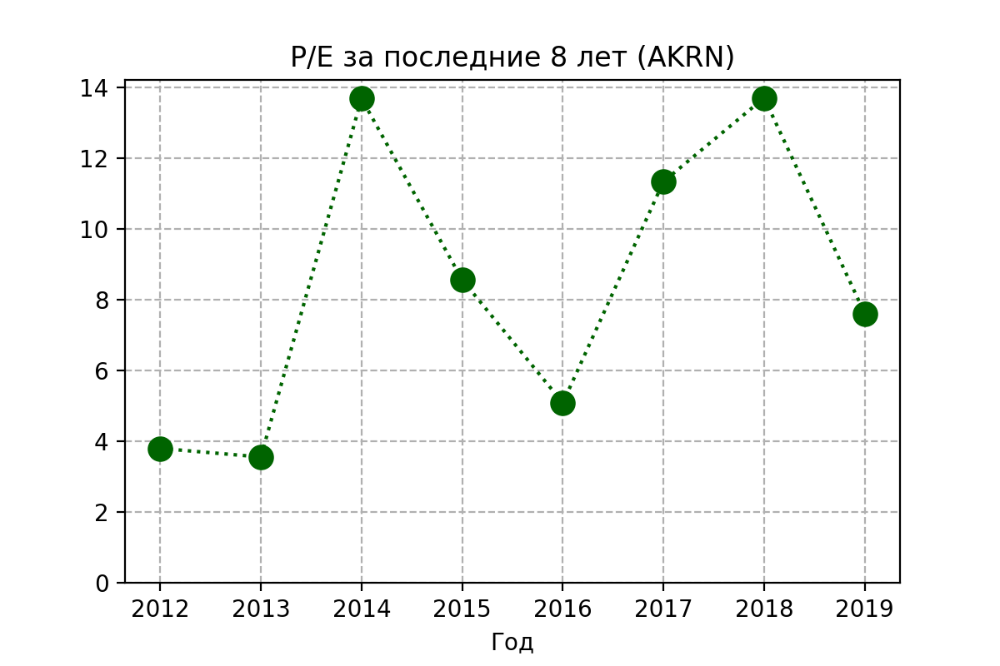

**Химическая промышленность / [Акрон](https://www.acron.ru) (AKRN)**

> Группа «Акрон» входит в число крупнейших мировых производителей минеральных удобрений (*оф. сайт Акрон*)

## Динамика выручки, капитала, обязательств, активов

Выручка в целом растёт, но несильно. 
Активы существенно не растут, бизнес уже активно не растёт.
Смущает низкое отношение выручки к активам компании.

Теперь смотрим на зависимость чистой прибыли и EBITDA

Прибыль есть, это хорошо

Теперь посмотрю на динамику свободного денежного потока (FCF) - более продвинутого показателя, который и сложнее подделать

Денежный поток генерируется довольно стабильно, особенно в последние три года.
Стабилизировалось изменение оборотного капитала.
Расходы на capex больше амортизации, значит, компания инвестирует в новые проекты, хорошо.

Высокий показатель, последние пять лет держится на уровне выше 80%, приятно.

Теперь посмотрю детальнее на выручку

На диаграмме видно большое количество регионов поставок.
У Акрона высокая диверсификация по регионам продаж, хорошо.

Теперь динамика коэффициента текущей ликвидности, на всякий случай:

Коэффициент ниже оптимального уровня.

## Дополнительные факторы

1. *Неопределённость из-за коронакризиса*
    (Нестабильность рынков по всему миру из-за коронавируса неопределённым образом влияет на компанию)

1. *Охрана окружающей среды*
    (Потенциальные обязательства, которые могут возникнуть, могут оказаться значительными, но не могут быть оценены)

1. *Валютный риск*
    (Ослабление доллара приведёт к росту прибыли)
    
1. *Риск недостаточности капитала* 
    (Акрон поддерживает отношение заёмных и собственных средств на уровне не более 150%.
    В 2019 году этот показатель составлял 106%)
    
## Дивидендная политика

> Дивидендная политика Акрона подразумевает отчисление на дивиденды не менее 30% от чистой прибыли по МСФО, при этом компания стремится выплачивать дивиденды не менее 2 раз за финансовый год (могут и три раза в год - третья выплата производится из нераспределенной прибыли и плохо прогнозируема). <...> стараются повышать дивиденды год к году. (согласно [dohod.ru](https://www.dohod.ru/ik/analytics/dividend/akrn))

Стабильно высокие дивиденды.

## ROA
Отвечает на вопрос, выгоднее ли "владельцу" всё продать и положить деньги на депозит?

Высокий показатель ROA, за последние 5 лет не опускался ниже 6%, хорошо

## Оценка компании
Теперь, пользуясь мультипликаторами, можно попробовать проверить, недооценена или переоценена компания на бирже

### Капитализация

Капитализация стабильно растёт.

### P/E
Через сколько лет окупится инвестиция, если прибыль останется на том же уровне и всю прибыль руководство направит на дивиденды

В 2019 году показатель существенно упал.

### P/S
Отношение рыночной капитализации компании к её годовой выручке. 
Показатель <1 может говорить о недооценённости компании

P/S в области адекватной оценки компании

### EV/EBITDA

### Долг/EBITDA

## [Планы](https://www.acron.ru/about-acron-group/invest-programme/) на будущее

У группы большая инвестпрограмма до 2025 года

## Вывод

Акрон стабильно платит довольно высокие дивиденды, в целом показатели в порядке (только смущает коэффициент текущей ликвидности) в том числе FCF.
Хороший менеджмент, судя по показателю ROA, а также множество рынков сбыта также радуют.