**IT / [Mail.ru Group](https://corp.mail.ru) (MAIL)**

> Компании принадлежат ведущие русскоязычные социальные сети – ВКонтакте и Одноклассники, лидирующий почтовый сервис, один из самых посещаемых порталов в рунете (Mail.ru), мессенджеры ICQ, Tam Tam, Агент Mail.ru и Myteam. Также в состав Mail.ru Group входит международный игровой бренд MY.GAMES, в портфеле которого сотни популярных игр для разных платформ с аудиторией более 540 миллионов пользователей по всему миру. Mail.ru Group владеет сервисом частных объявлений Юла, сервисом MAPS.ME, предоставляющим офлайн-карты и навигацию для мобильных устройств на основе данных OpenStreetMap, долями в сервисах GeekBrains, Skillbox и в школе программирования «Алгоритмика». Mail.ru Group является акционером СП AliExpress Россия вместе с Alibaba Group, МегаФоном и РФПИ, а также совместно со Сбербанком развивает O2O-платформу в сфере еды и транспорта. (**сайт Mail.ru Group**)

## Динамика выручки, капитала, обязательств, активов

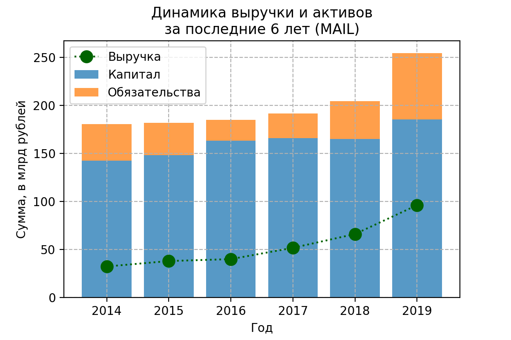
Активы растут и выручка вместе с ними, выглядит хорошо. 
Отдельно стоит отметить низкую долю обязательств в активах.
В то же время отношение выручки к активам низкое.

Рассматриваем распределение выручки по продуктам компании 
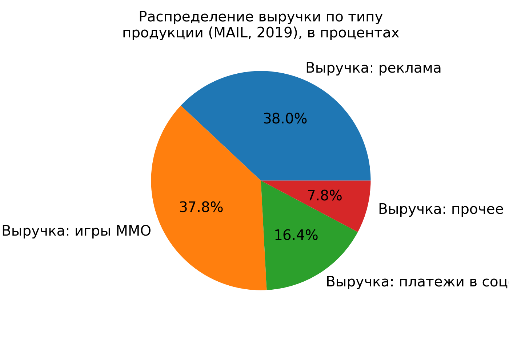
Видим, что доля выручки от игр сравнима с рекламой, причём если посмотреть на график по типам выручки за последние годы, то видно, что выручка от игр существенно увеличилась в последний год.
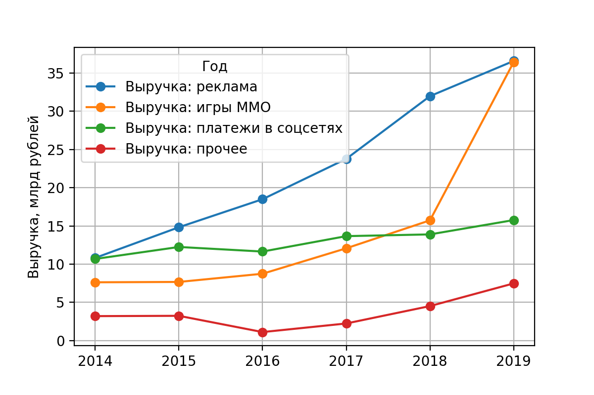
Также стоит отметить, что выручка от рекламы стабильно растёт.

## Чистая прибыль
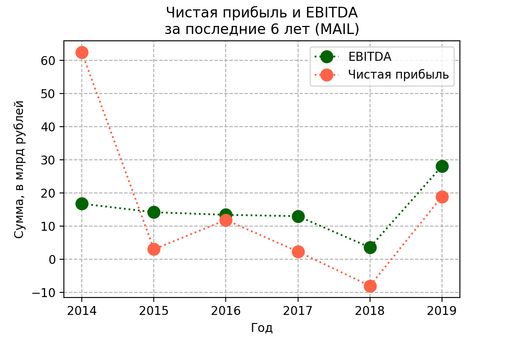
На графике показана динамика показателей EBITDA и чистой прибыли за последние 6 лет. 
EBITDA держится стабильно на одном уровне, в последнее время даже подросла.

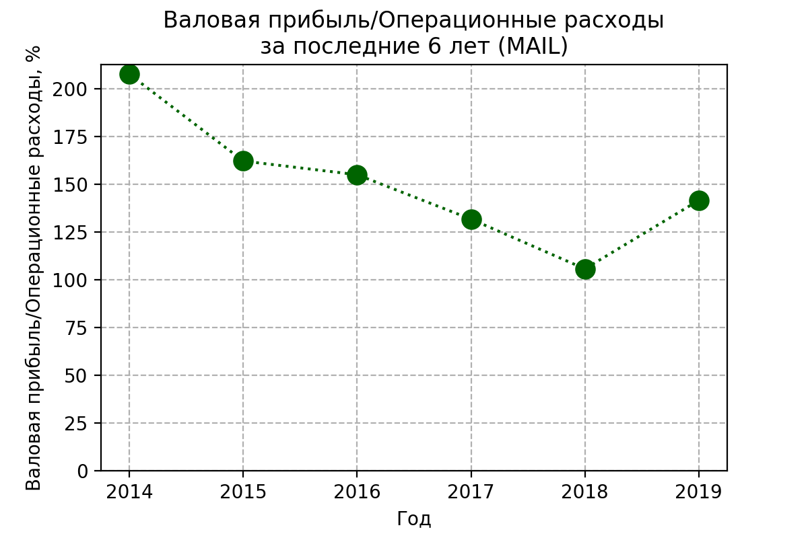
Себестоимости в МСФО Mail.ru я не нашёл, поэтому смотрю отношение Валовой прибыли к операционым затратам (что-то вроде добавленной стоимости).
Довольно высокий показатель, это хорошо. В последнее время отношение уменьшилось, что может быть связано с появлением доставки еды, такси и т.д., т.к. людям платить надо.

## Свободный денежный поток (FCF)
По новой традиции посмотрю динамику свободного денежного потока - показателя, характеризующего как хорошо компания умеет делать деньги.
Этот показатель более объективен чем чистая прибыль, которую можно нарисовать.
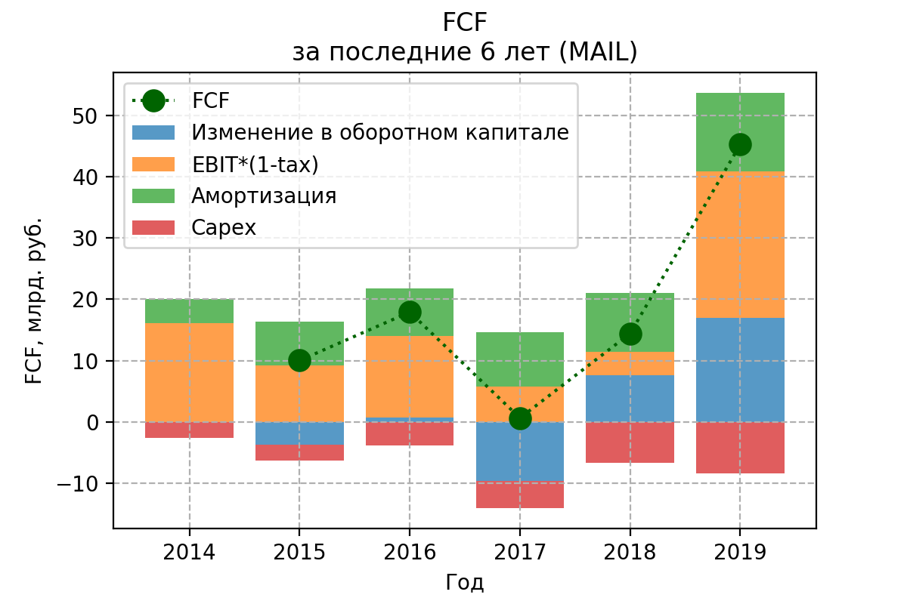
Видно, что свободный денежный поток генерируется довольно стабильно, в последний год резко увеличился.

## Коэффициент текущей ликвидности
показывает, как компания может погашать текущие обязательства за счет только оборотных активов.
Чем выше коэффициент, тем выше платежеспособность предприятия. Если этот показатель ниже 1,5, значит, предприятие не в состоянии вовремя оплачивать все счета.
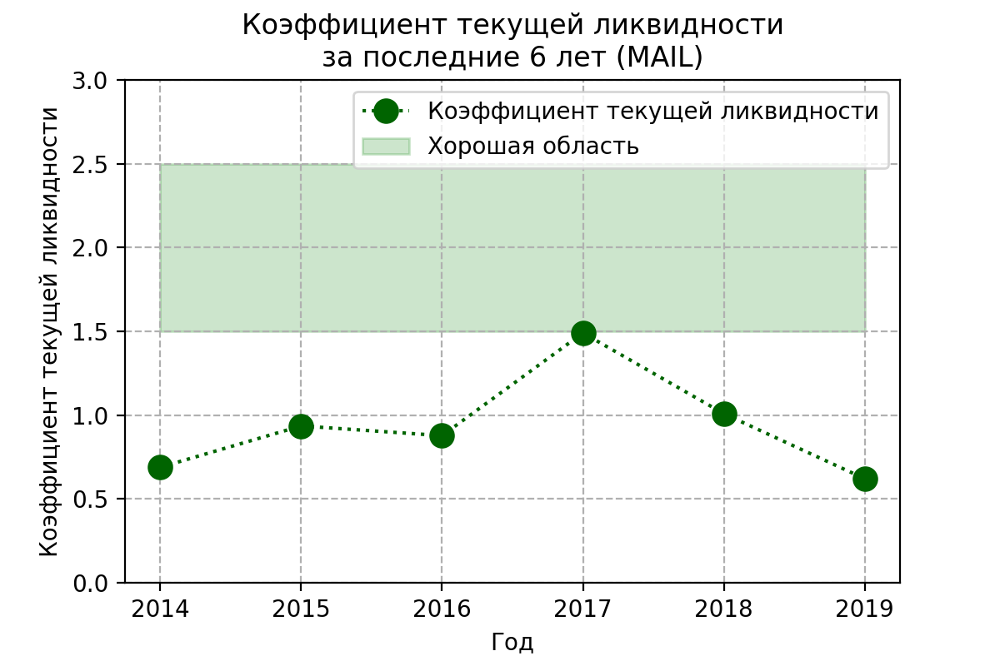
Низкий коэффициент текущей ликвидности, возможно из-за специфики сектора.

<!-- ## Риски -->
<!-- 1. *Валютный риск* 
    (Укрепление доллара уменьшает прибыль)
    
1. *Кредитный риск*
    (Риск возникновения дебиторской задолженности, поэтому компания выбирает надёжных клиентов)
    
1. *Риск ликвидности*
    (Компания пытается снижать количество краткосрочных кредитов и поддерживать текущий уровень ликвидности)
    
* Компания участвует в судебных разбирательствах (не оказывают существенного влияния)
* Компания частично застрахована, но не застрахована от простоев
* Компания опасается (но несильно) за правильный подсчёт налогов -->

<!-- ## Дивидендная политика

В 2019 году впервые были выплачены дивиденды, однако с небольшим процентом.
Но компания пока растёт, так что такая ситуация по дивидендам ожидаема. -->

## ROA
Отвечает на вопрос, выгоднее ли "владельцу" всё продать и положить деньги на депозит?
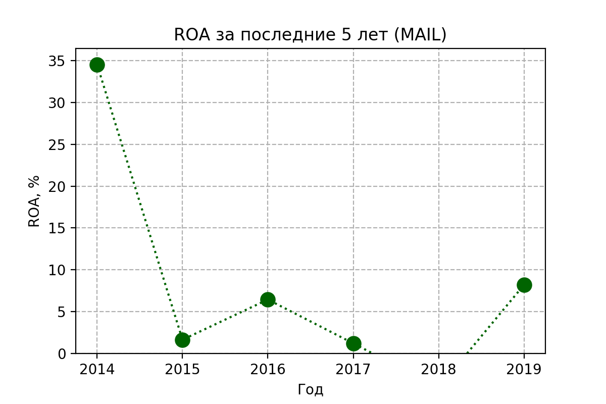
ROA довольно сильно колеблется.

## Оценка компании
В этом разделе посмотрю на мультипликаторы

### Капитализация

Капитализация в 2019 году резко подскочила.
MAIL.ru group торговался на Лондонской бирже, и только в этом году появился на Московской, поэтому капитализация пересчитывалась в рубли.

### P/E
Через сколько лет окупится инвестиция, если прибыль останется на том же уровне и всю прибыль руководство направит на дивиденды
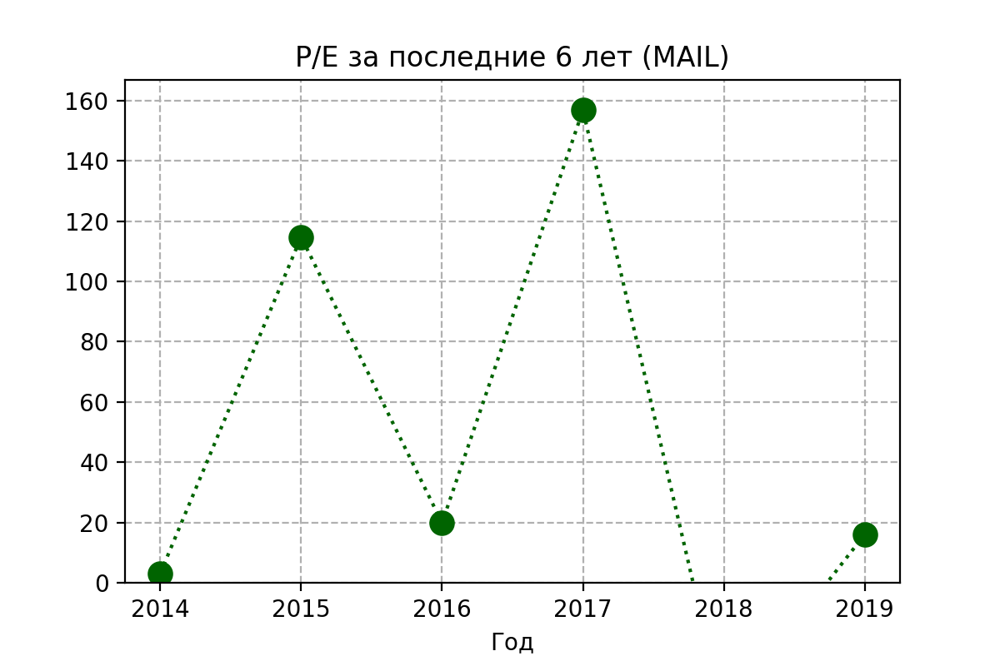
Огромные показатели P/E, может ошибка в моих расчётах.

### P/S
Отношение рыночной капитализации компании к её годовой выручке. 
Показатель <1 может говорить о недооценённости компании
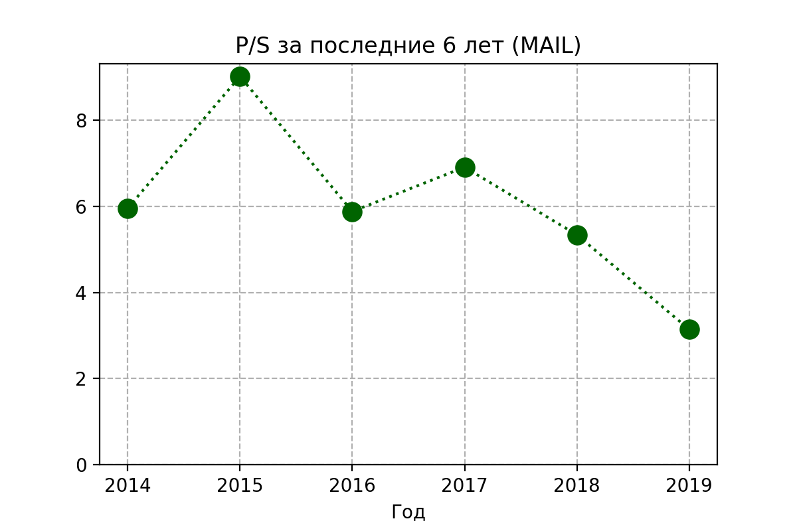
P/S тоже огромный.

### EV/EBITDA Долг/EBITDA
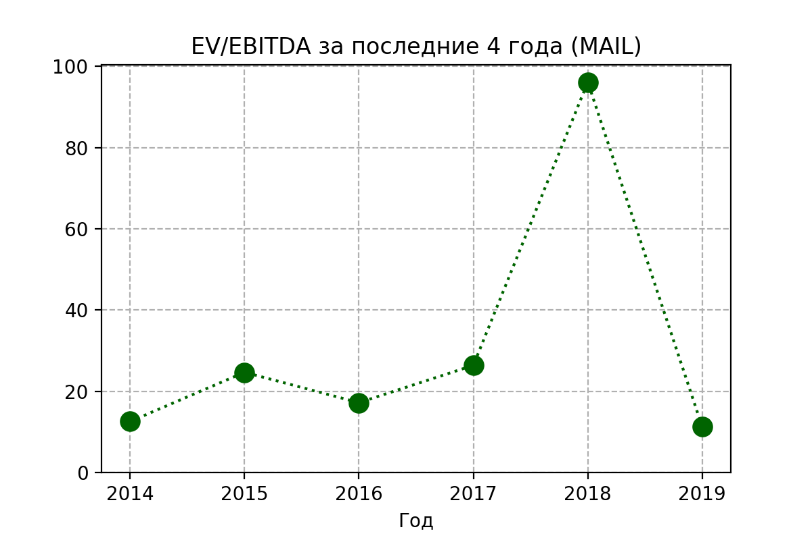
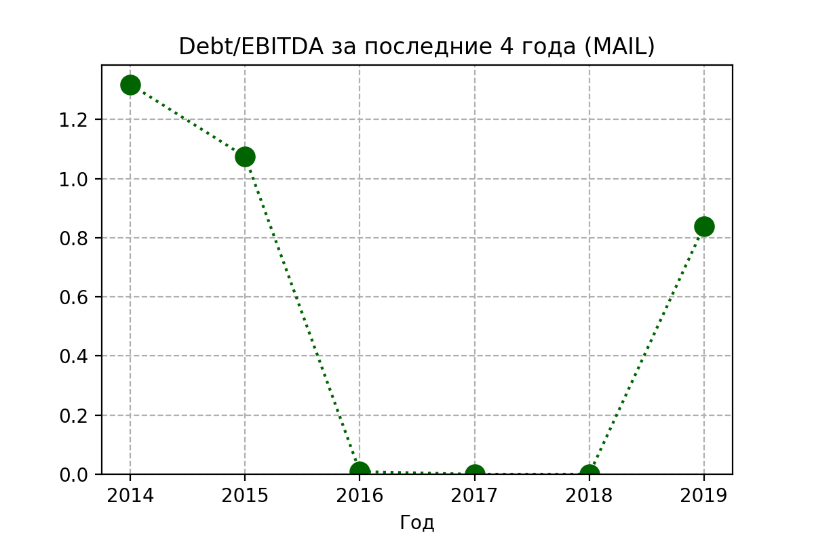

EV/EBITDA по сравнению с P/E выглядит симпатичнее

<!-- ## [Планы](https://www.himprom.com/presscentr/news/11636/) на будущее

1. В 2019 построили единственное в РФ производство реагента для нейтрализации стоков процесса золотодобычи и водоподготовки
1. Реализуется (до 2022) создание нового производства пероксида водорода по антрахиноновой технологии мощностью 50 тысяч тонн в год
1. Несколько проектов по оптимизации затрат -->

## Вывод
Mail.ru одна из немногих публичных IT-компаний, но хотя выручка стабильно растёт, доля долга низкая, но показатели P/E, EV/EBITDA и т.п., указывают на текущую переоценённость компании. Акции долгое время не растут, а дивиденды не выплачиваются.