**Банки / [Сбер](https://www.sberbank.com/ru/investor-relations/reports-and-publications/ifrs#) (SBER)**

> Сбербанк — крупнейший банк в России, Центральной и Восточной Европе, один из ведущих международных финансовых институтов (**сайт Сбер**)

## Динамика капитала, обязательств, активов
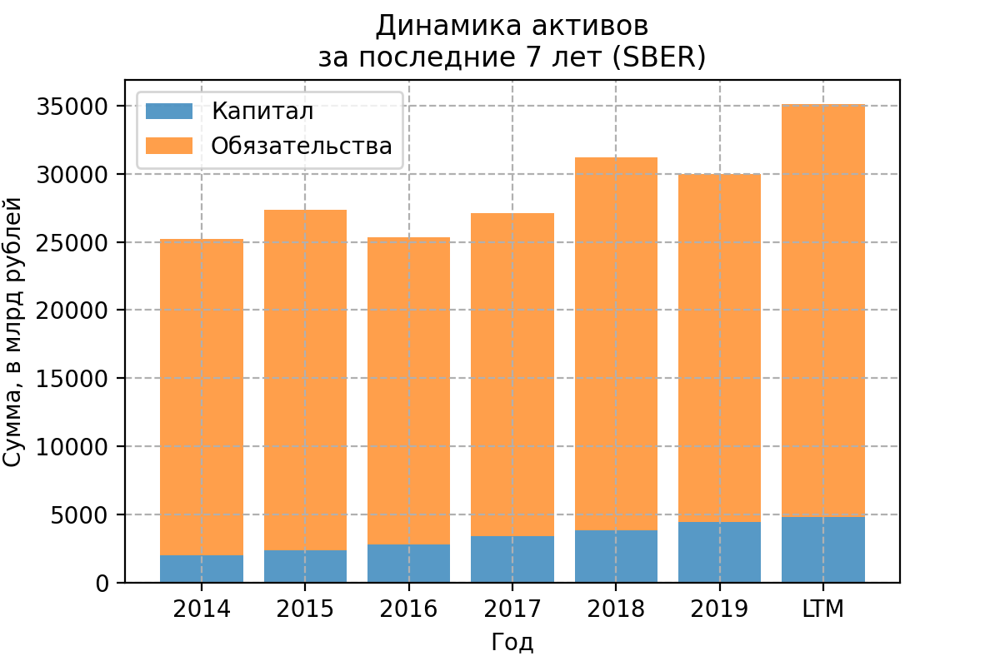
Огромная доля обязательств в активах. Возможно из-за специфики банковской сферы. Нужно отметить, что прослеживается динамика роста капитала.

Посмотрю из чего состоят обязательства:
более 50% обязательств (15,8 трлн руб.) согласно [последнему отчёту](https://www.sberbank.com/common/img/uploaded/files/info/ifrs2020/20/20209mruifrs9m_presentation.pdf) составляют средства физических лиц (т.е. вклады),
ещё около 30% (9,4 трлн руб.) составляют средства корпоративных клиентов.

Получается, что огромная доля обязательств от того, что большое количество людей доверяет банку и вкладывает туда свои деньги.

Сбер собственные активы даёт в кредит, что и является основной деятельностью. Посмотрю, как распределены кредиты по сегментам:
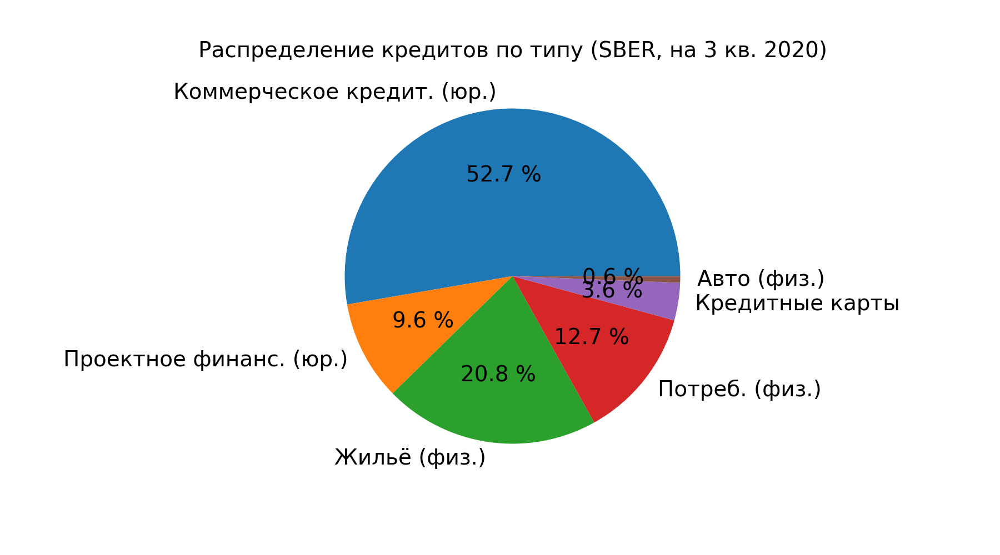
большую часть занимает коммерческое кредитование юридических лиц.

Теперь посмотрю на динамику кредитования:
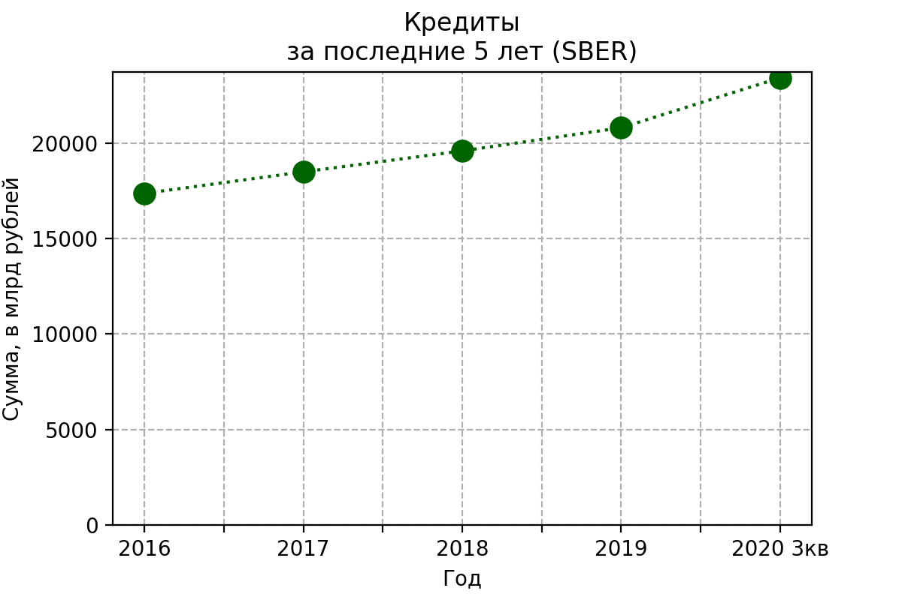
количество кредитов в денежном выражении растёт (в этом году особенно), что хорошо.

## Чистая прибыль
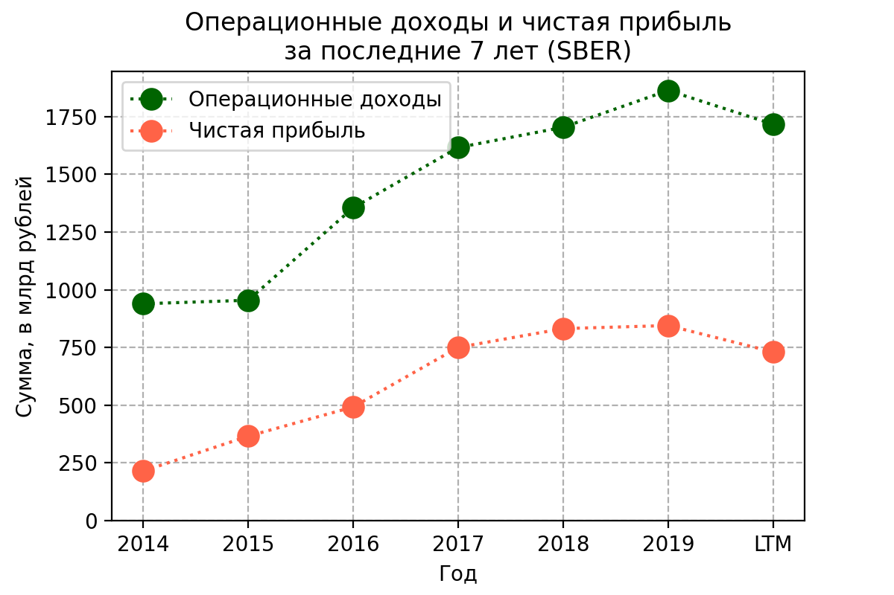
На графике показана операционная и чистая прибыль Сбера за последние 7 лет.
Видно, что операционная прибыль выросла за эти годы практически вдвое. 
Показатели чистой прибыли тоже радуют.

Операционная прибыль состоит из двух основных частей: процентных и комиссионных доходов.
Чистые процентные доходы (проценты по вкладам) составили 1,42 трлн руб., чистые комиссионные доходы (операции с банковскими картами и кассовое обслуживание) - 0,5 трлн руб. согласно МСФО за 2019 год. 

## Дивидендная политика
Согласно дивидендной политике Сбербанк будет стремится выплачивать 50% чистой прибыли по МСФО. Такие дивиденды будут поддерживаться при уровне достаточности капиала в 12.5%. (согласно [dohod.ru](https://www.dohod.ru/ik/analytics/dividend/sber))
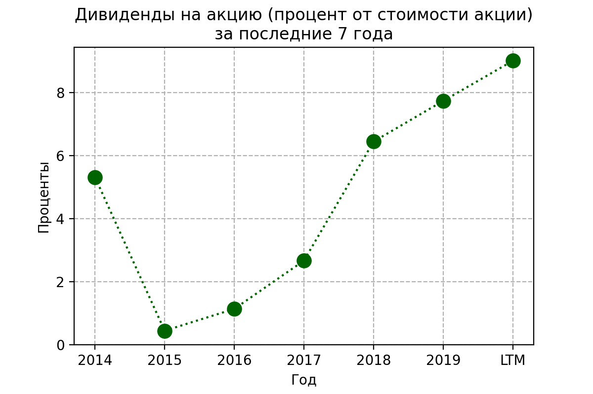

## Оценка компании
В этом разделе посмотрю на мультипликаторы

### Капитализация
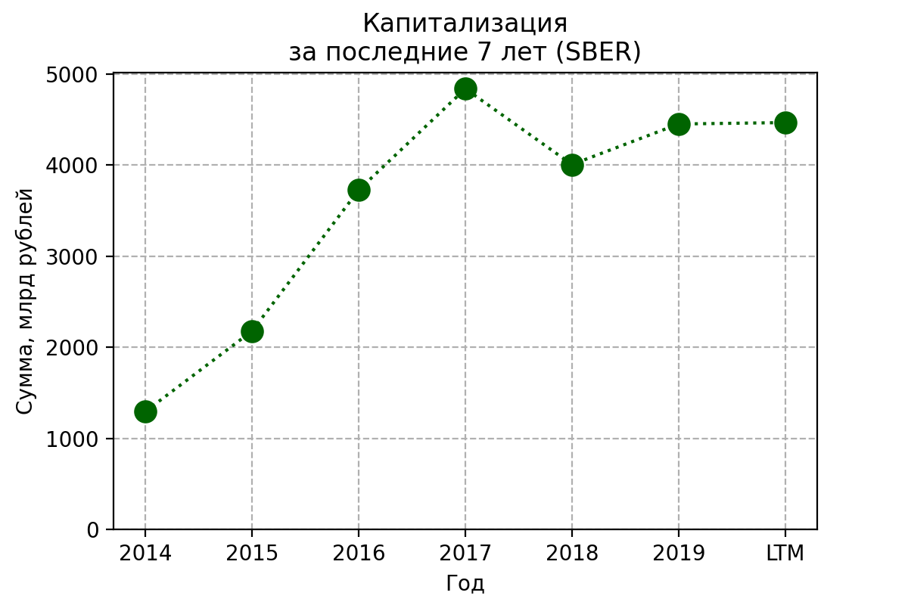
к 2017 году компания вышла на пик, дальше акции перестали расти, однако это компенсируется стабильными дивидендами (выше 6% из предыдущей картинки) после 2017 года. 

### P/E
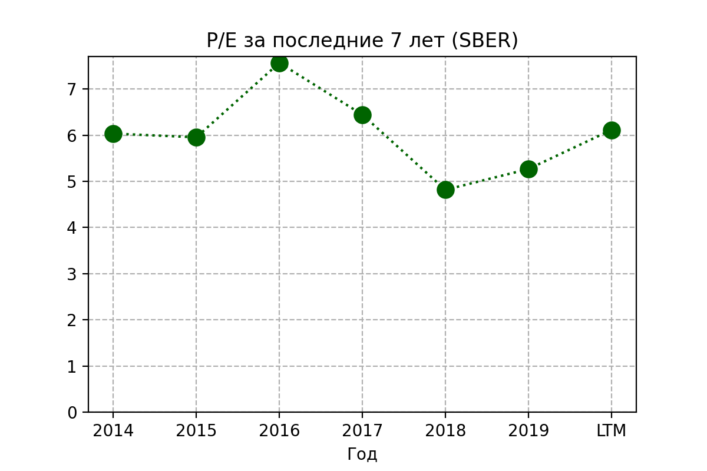
радует, что показатель держится примерно на одном уровне, не скачет

### P/BV
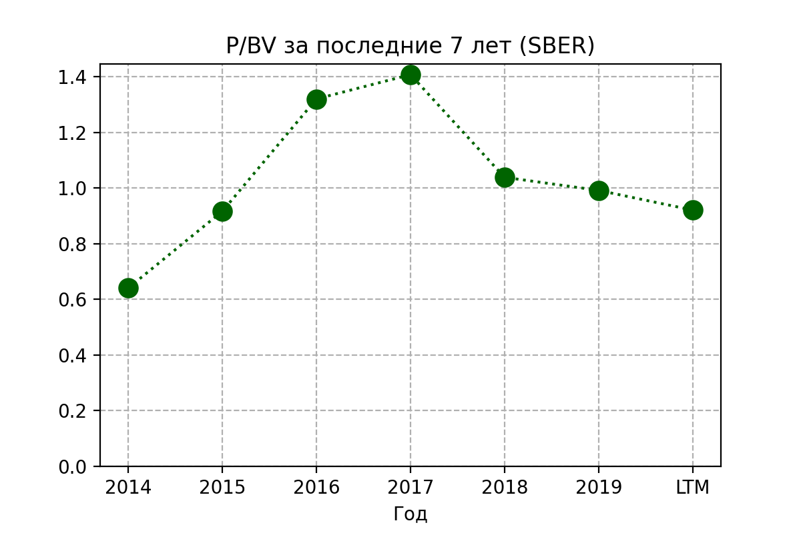
Показатель на довольно хорошем уровне (<1).
Вряд ли Сбер обанкротится, но если вдруг такое произойдёт, то у него будет, что вернуть инвесторам.

### ROA и ROE
Ниже показаны графики рентабельности активов и рентабельности капитала
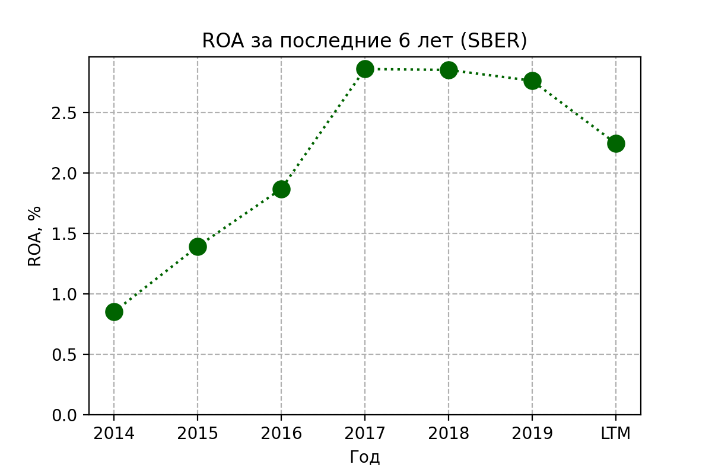
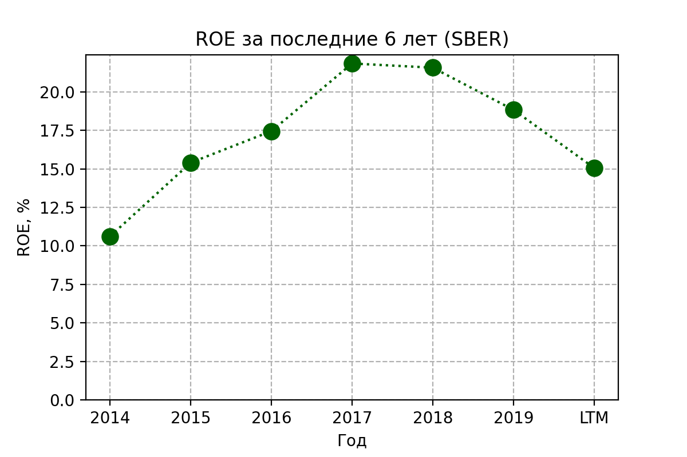
Показатели немного просели в последние годы.

Сравниваю мультипликаторы разных организаций

видно, что у Сбера не лучшие значения мультипликаторов по отрасли, но и не худшие. 

## Корреляции
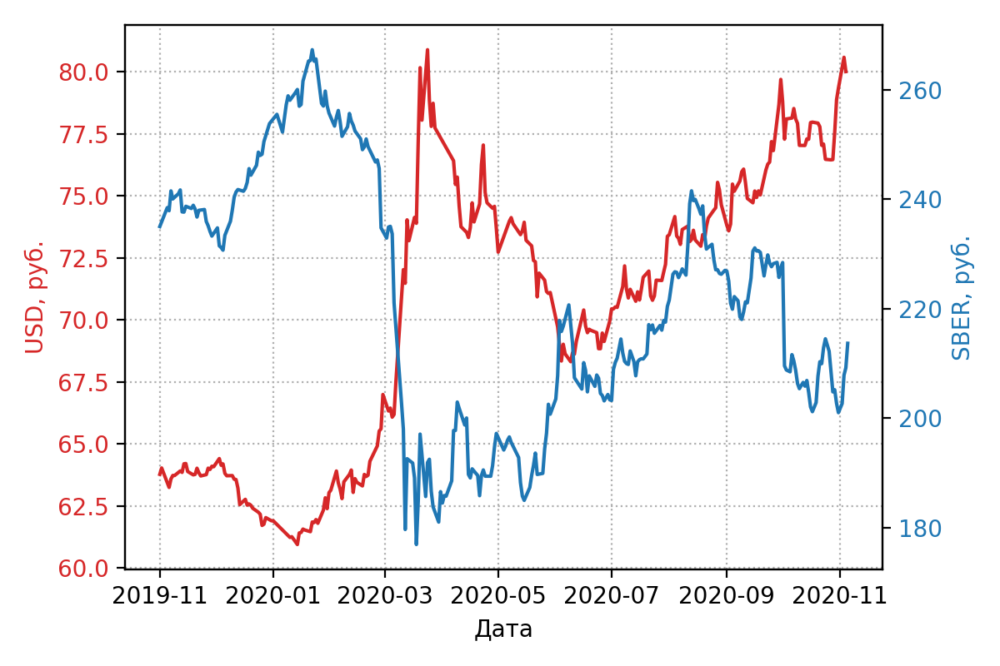
Корреляция между ценой акции Сбера (красный на графике) и ценой доллара США (синий) за последний год составила **-0.73**.
(Корреляция между Сбером и индексом МосБиржи **0.91**) 

## Планы
развитие [экосистемы](https://www.sberbank.com/ru/eco)

## Вывод
Крупнейший банк России - поддерживается государством, хорошие растущие показатели прибыли и масштабные планы построения крупной экосистемы вокруг банка делают Сбер интересным вариантом. Однако стоит рассмотреть конкурентов, чтоб взглянуть более объективно.