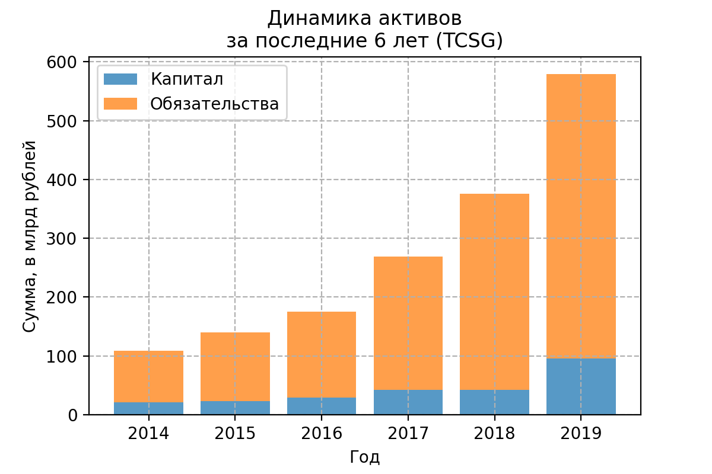
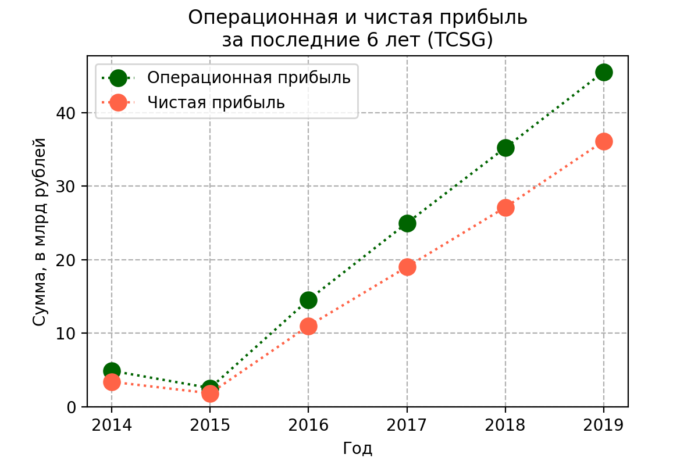
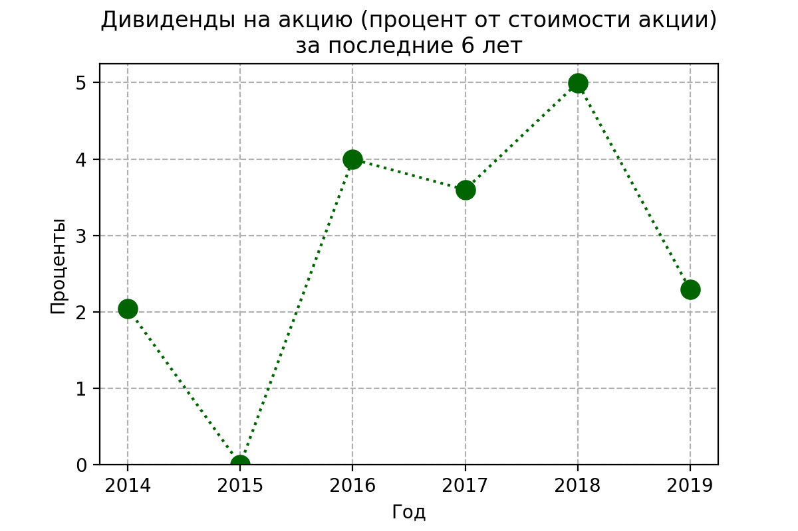
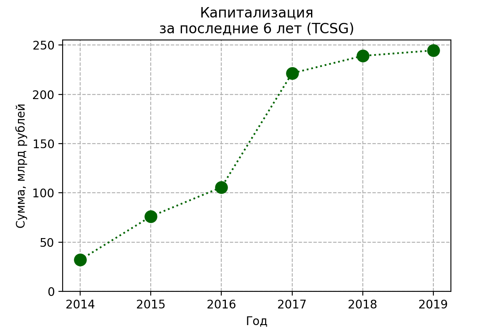
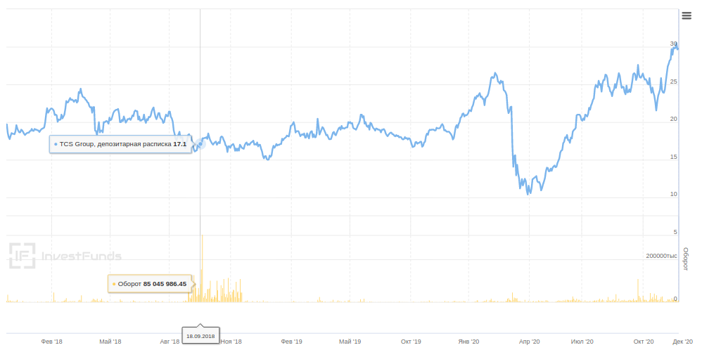
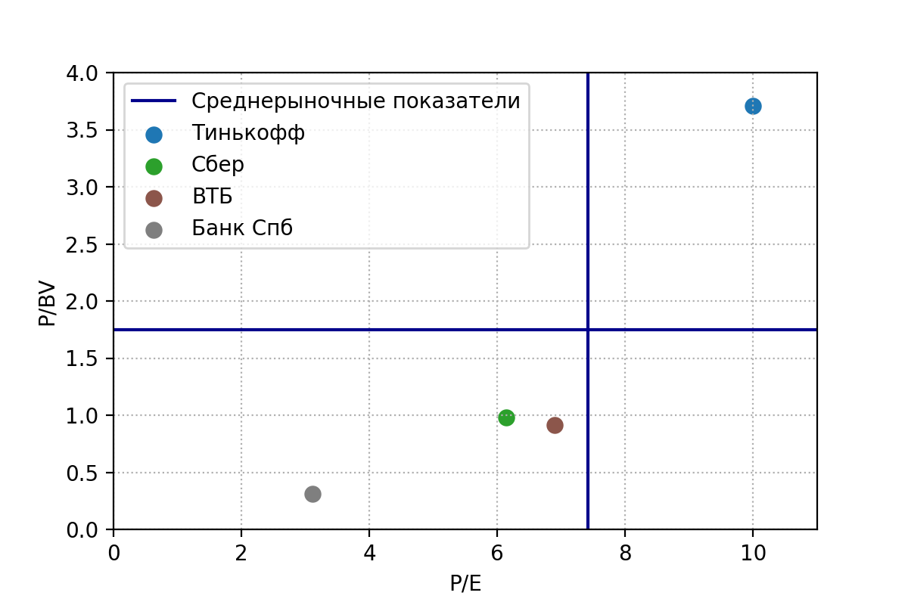
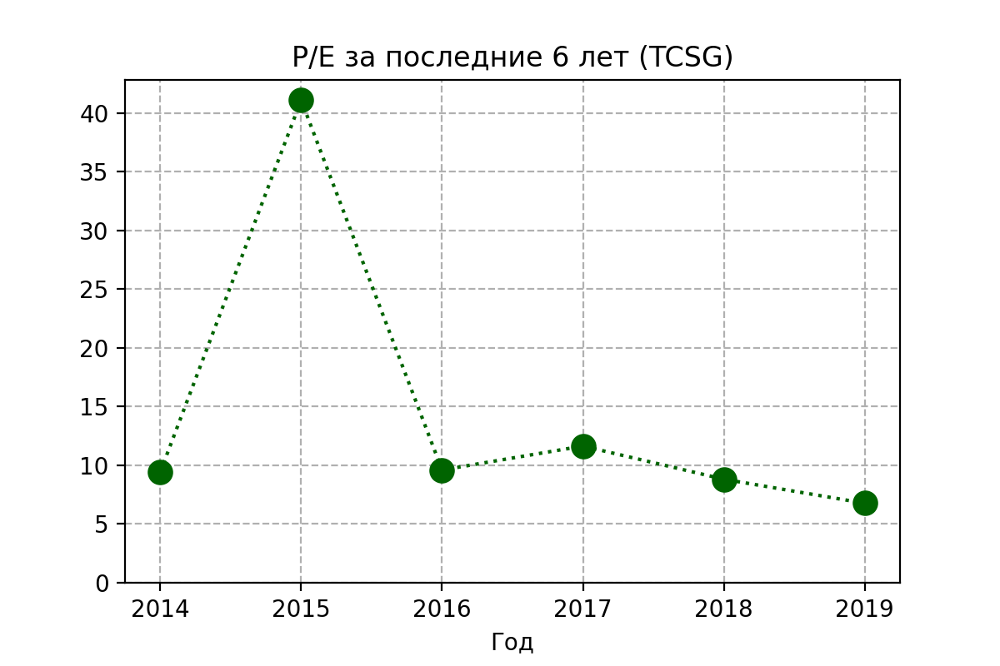
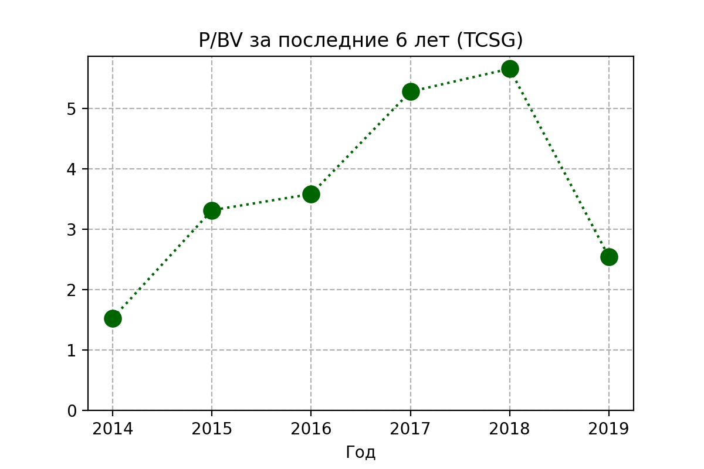
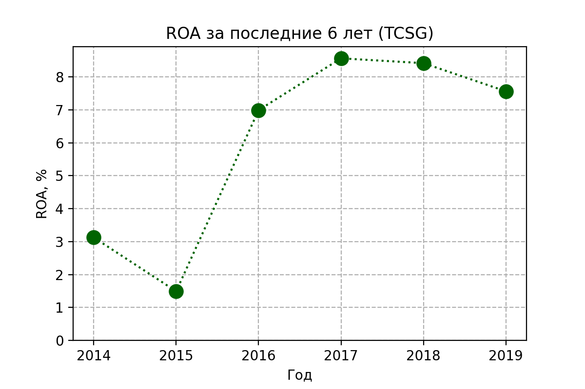
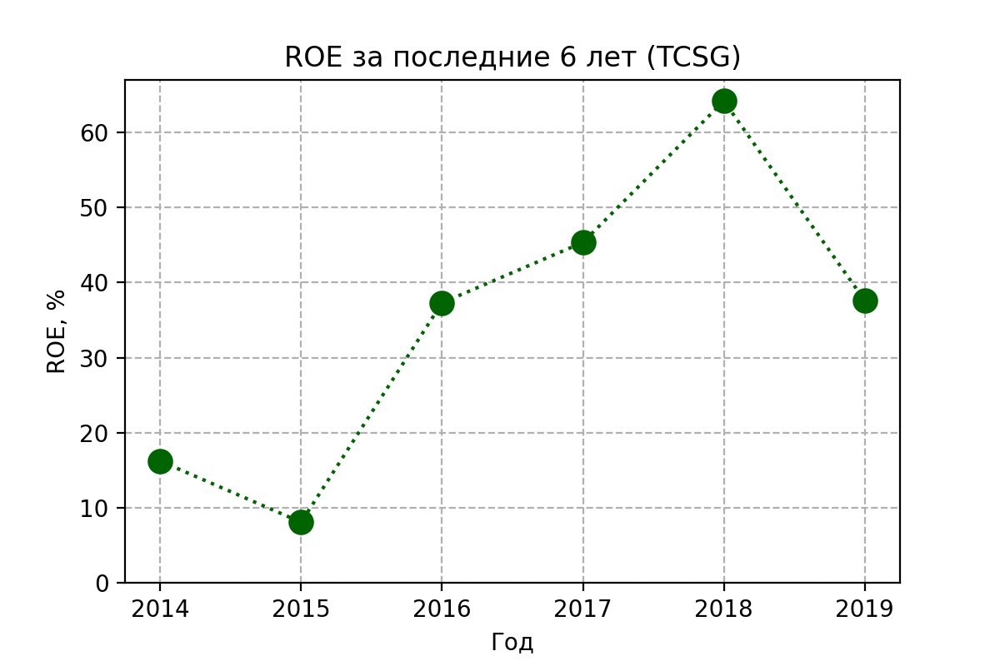

> Тинькофф — третий крупнейший в России банк по количеству активных розничных клиентов (19% респондентов). Тинькофф лидирует среди частных банков и уступает только двум госбанкам - Сберу (87% респондентов) и ВТБ (23%) - по частоте пользования розничными клиентами (**сайт Тинькофф-банка**)

## Динамика капитала, обязательств, активов

Активы растут с каждым годом - это очень здорово. Непонятно, что
значит большая доля обязательств - возможно, это специфика банковской
сферы. Для обязательств на конец 2018 год 84% составляют средства
клиентов.

## Чистая прибыль

Операционная прибыль быстро растёт с каждым годом - банк
раскручивается. 

## Дивидендная политика
Тинькофф банк выплачивает дивиденды акционерам. Процент в стоимости от
акции сейчас не очень большой.

## Капитализация компании

Акции компании очень хорошо выросли на Московской бирже - на 20 ноября 2020
года одна акция стоит 2267 рублей по сравнению с ценой в 1206 рублей год назад
(рост в 1.86 раз). На Лондонской бирже цена повысилась в 1.56 раз за
год. Так что вроде бы этот рост не связан только с курсом доллара. 

Вообще за период с 2017 по 2019 год цена акций на Лондонской бирже
была более-менее стабильной, а потом их начало мотать. Стоит подробнее
разобраться, почему сначала был провал, а потом скачок в цене.

## Оценка компании
В этом разделе рассмотрим мультипликаторы. Для начала посмотрим, как в
среднем выглядят мультипликаторы для банковской сферы.

Чем ближе бизнес к левому нижнему углу на этой диаграмме, тем выгоднее
в него инвестировать на данный момент. Тинькофф банк в этом плане не радует
(по крайней мере, если верить этой картинке).

### P/E

Из моих данных следует, что P/E несколько больше, чем среднее по
области. Прибыль у компании неплохо растёт, и, видимо, поэтому P/E
немного подупал к концу 2019 года. Я бы дополнительно посмотрела на
показатели 2020 года, когда они появятся, но пока что похоже на то,
что инвесторы переоценивают компанию.

### P/BV

Показатель довольно нестабильный, это не очень хорошо. А если верить
картинке для среднего по области, где, скорее всего, используются
более новые данные за 2020 год, P/E и P/BV вообще улетели в
стратосферу.

### ROA и ROE
Ниже показаны графики рентабельности активов и рентабельности капитала

Неплохие показатели, как мне кажется.

## Вывод
Из той информации, что у нас сейчас есть, следует, что скорее не
стоит, чем стоит покупать акции TCSG. Но я бы дополнительно посмотрела
на данные 2020 года, а также на бизнес-планы Тинькофф банка. Да,
скорее всего бизнес переоценен, но почему-то же люди покупают эти
акции. Если будут хотеть покупать и дальше, то не самое плохое
вложение получится :)
