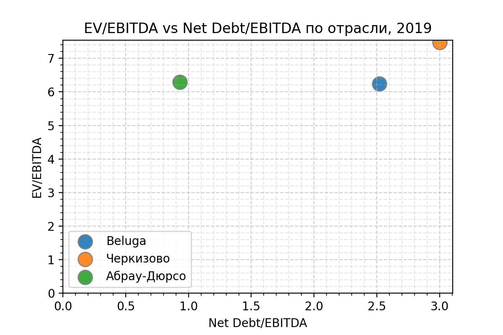

**Алкоголь / [Beluga Group](https://belugagroup.ru) (BELU)**

> Крупнейшая российская алкогольная компания.
Мы производим и продаем самые лучшие алкогольные напитки в России и за рубежом. (**сайт Beluga Group**)

## Общие показатели

### Выручка и активы

Активы растут и выручка вместе с ними, что здорово. 
В последние годы видно, что объём активов наращивается за счёт увеличения доли обязательств, и это возможно не очень хорошо, будем разбираться дальше.

### Чистая прибыль и EBITDA

На графике показана динамика показателей EBITDA и чистой прибыли. 
Показатели непрерывно растут с 2015 года, что говорит в пользу этого бизнеса.
Также радует, что компания всегда была в плюсе.

## Финансовое здоровье

1. **Quick ratio** (коэффициент срочной ликвидности) — cпособность компании погасить краткосрочные обязательства за счет быстрореализуемых активов — *ниже рекомендованого уровня в 1.*
1. **Current ratio** (коэффициент текущей ликвидности) — показывает, как компания может погашать текущие обязательства за счет только оборотных активов — *в пределах рекомедуемого диапазона 1.5 - 2.*
1. **Debt / Eq** — соотношение заемных средств к собственному капиталу. Оценивает финансовую устойчивость организации — *выше рекомендованного уровня, последние годы рос (как видно из первой картинки)*

## Эффективность компании

### Чистая рентабельность и валовая маржа

1. **Net Margin** — чистая рентабельность, отношение чистой прибыли к выручке. Если у бизнеса высокая маржинальность, то он более устойчив к падению цен на его продукт или к росту цен на сырье, задействованное в производстве. — *рентабельность на низком уровне, есть тренд на рост, но до уровня 2013 довольно далеко*
1. **Gross margin** — валовая маржа, выручка компании за вычетом себестоимости реализованных товаров. Таким образом, чем выше средняя маржа валовой прибыли, тем больше компания сохраняет финансов на каждый рубль продаж, которые она затем может направить для обслуживания других расходов или обязательств — *тренд на падение относительно 2013, 2014*

### ROE, ROA

1. **Return on Equity** — характеризует эффективность использования средств акционеров. (Сколько прибыли принес один вложенный акционерами доллар в процентном соотношении.) Чем параметр выше, тем лучше, но ROE меньше 20% считается низким. — *восходящий тренд, но в числах показатели низкие*
1. **Return on Assets** — коэффициент рентабельности активов, показывающий процентное соотношение чистой прибыли предприятия к его общим активам — *низкий уровень, ниже ставок по депозитам*

## Дивидендная политика
> Размер дивидендных выплат установлен на уровне не менее 25% от прибыли по МСФО. Дивиденды планируют выплачивать 2 раза в год. Впервые дивиденды выплатили по итогам 2019 года в размере 30% от прибыли по МСФО или 88% от прибыли по РСБУ. (согласно [dohod.ru](https://www.dohod.ru/ik/analytics/dividend/belu))

**Payout** — доля прибыли, направленной на дивиденды (обычно норма до 50%) — *здесь 25% за 2020, нормальный показатель*

**Дивидендная доходность** — отношение величины годового дивиденда на акцию к цене акции — *доходность ниже ставок в банке, а риск выше*

## Оценка компании (мультипликаторы)

### Капитализация

**Капитализация** — стоимость одной акции, умноженная на их количество на бирже. Обычно чем крупнее компания, тем она устойчивее. В малых компаниях нужно адекватно оценивать риск.

### P/E

**P / E** — отношение стоимости акции к чистой прибыли компании на одну акцию. Сколько годовых прибылей стоит компания.

### EV/EBITDA vs Чистый Долг/EBITDA

чем ближе к точке (0, 0), тем лучше — *средние показатели относительно хоть чуть-чуть похожих компаний*

### Оценка стоимости акций
Согласно DCF модели, стоимость акций BELU имеет потенциал к росту. Конкретные цифры можно посмотреть на [conomy.ru](https://www.conomy.ru/emitent/sinergiya/page-templates/3265/6899)

## Дополнительные факторы

### Риски по МСФО
1. *Валютный риск* 
    (Укрепление доллара уменьшает прибыль)
    
1. *Кредитный риск*
    (Риск возникновения дебиторской задолженности, поэтому компания выбирает надёжных клиентов)
    
1. *Риск ликвидности*
    (Компания пытается снижать количество краткосрочных кредитов и поддерживать текущий уровень ликвидности)
    
* Компания участвует в судебных разбирательствах (не оказывают существенного влияния)
* Компания частично застрахована, но не застрахована от простоев
* Компания опасается (но несильно) за правильный подсчёт налогов

## Вывод
Алкоголь в России — это интересно, компания производит огромное количество разных видов алкоголя в разных ценовых категориях. 

Субъекивные итоги:

## Источники
1. [Как я анализирую акции перед покупкой (Т—Ж)](https://journal.tinkoff.ru/analiz-emitenta/)
1. [Conomy.ru](https://www.conomy.ru/emitent/sinergiya)
1. [Dohod.ru](https://www.dohod.ru)