**Сельское хозяйство / [Русагро](https://www.rusagrogroup.ru/ru/) (AGRO)**

> Группа Компаний «РУСАГРО» - это крупнейший вертикальный агрохолдинг России. В настоящее время занимает лидирующие позиции в производстве сахара, свиноводстве, растениеводстве и масложировом бизнесе. <...> В 2015 г. по версии ряда инвестиционных банков Группа Компаний «Русагро» была признана одной из самых прибыльных и быстрорастущих компаний мира в потребительском сегменте в СНГ. (**сайт Русагро**)

## Общие показатели

### Выручка и активы

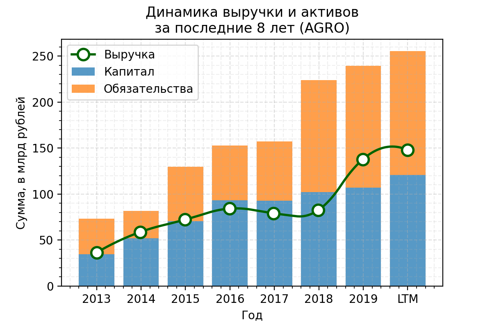
Активы стабильно растут, но смущает, что в последние несколько лет повысилась доля обязательств в активах. Выручка тоже растёт вслед за активами, что хорошо.

### Чистая прибыль и EBITDA
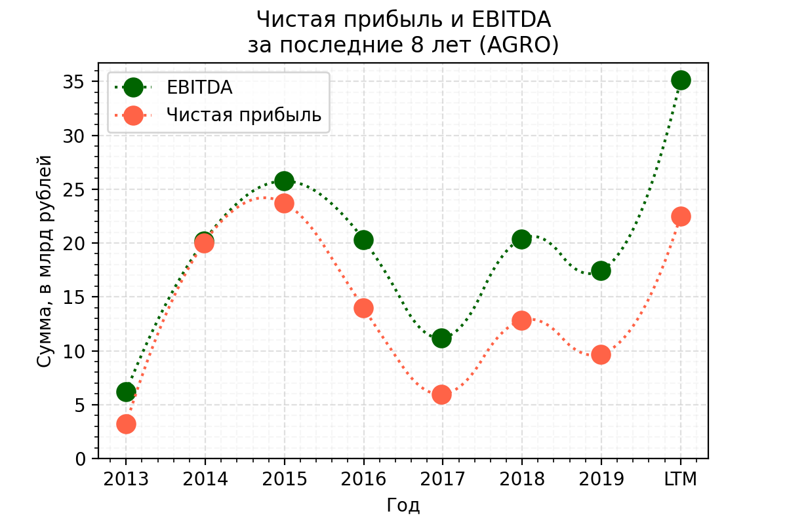
Радует, что компания прибыльна, но за последние 5 лет не наблюдается динамика роста.  

### FCF
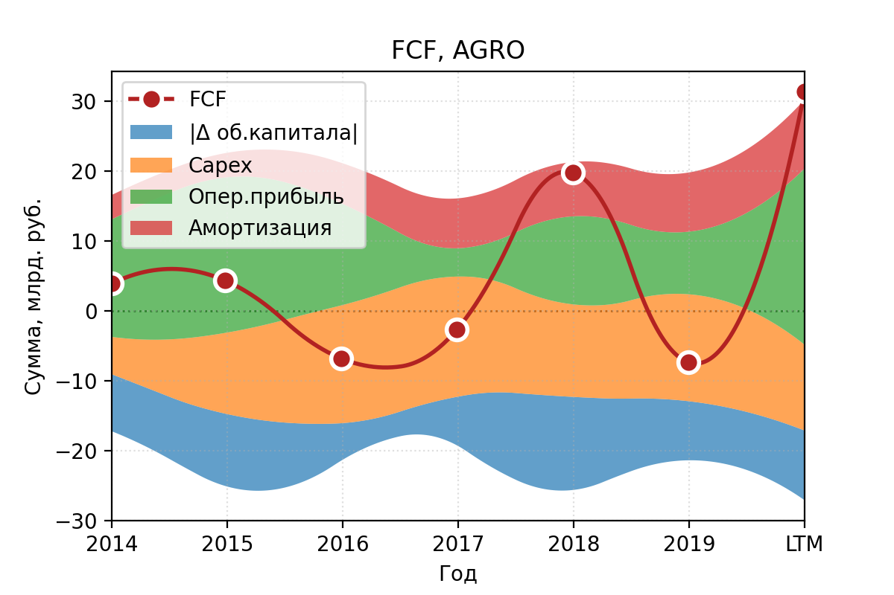
Свободный денежный поток нестабилен, часто отрицательный, что не радует.

## Финансовое здоровье
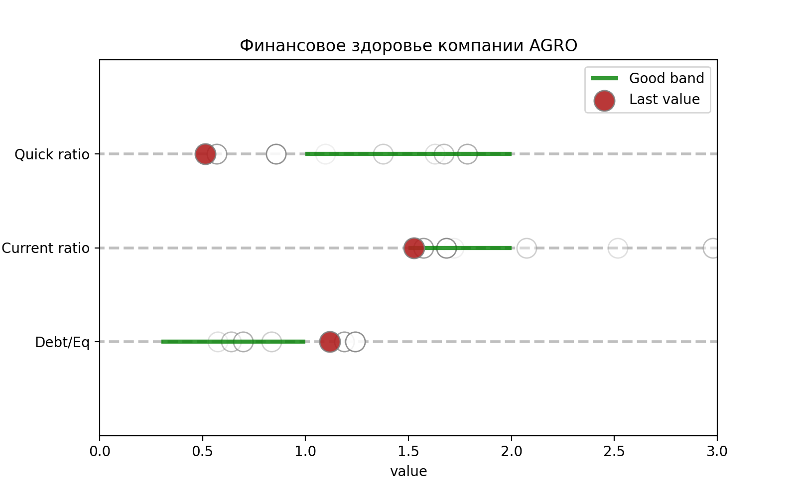
1. **Quick ratio** (коэффициент срочной ликвидности) — cпособность компании погасить краткосрочные обязательства за счет быстрореализуемых активов — *ниже рекомендованого уровня в 1.*
1. **Current ratio** (коэффициент текущей ликвидности) — показывает, как компания может погашать текущие обязательства за счет только оборотных активов — *в пределах рекомедуемого диапазона 1.5 - 2.*
1. **Debt / Eq** — соотношение заемных средств к собственному капиталу. Оценивает финансовую устойчивость организации — *чуть выше рекомендованного уровня*

## Эффективность компании

### Чистая рентабельность и валовая маржа
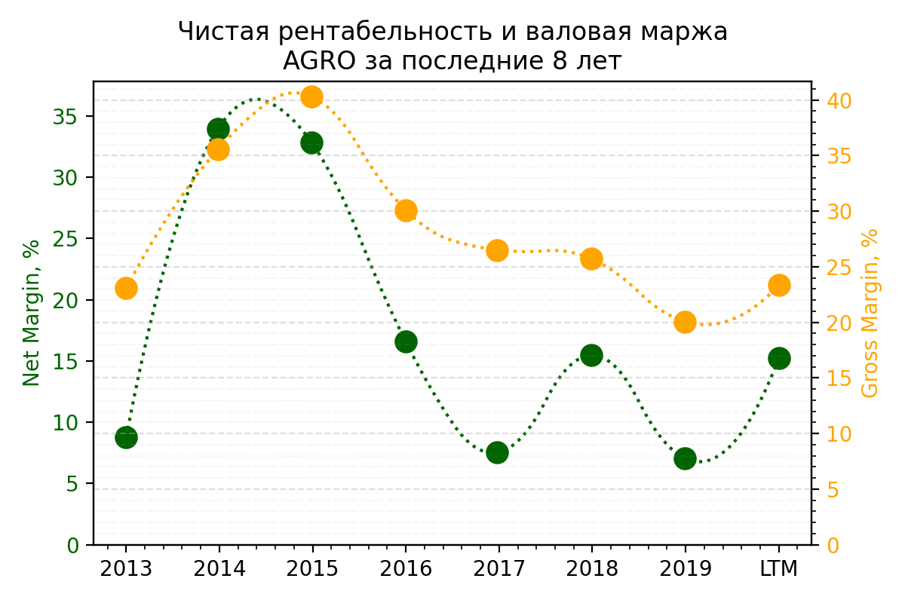
1. **Net Margin** — чистая рентабельность, отношение чистой прибыли к выручке. Если у бизнеса высокая маржинальность, то он более устойчив к падению цен на его продукт или к росту цен на сырье, задействованное в производстве. — *до 2016 высокий уровень, дальше колебания между 5 и 15%*
1. **Gross margin** — валовая маржа, выручка компании за вычетом себестоимости реализованных товаров. Таким образом, чем выше средняя маржа валовой прибыли, тем больше компания сохраняет финансов на каждый рубль продаж, которые она затем может направить для обслуживания других расходов или обязательств — *валовая маржа последние 5-7 лет имеет тренд на спад*

### ROE, ROA
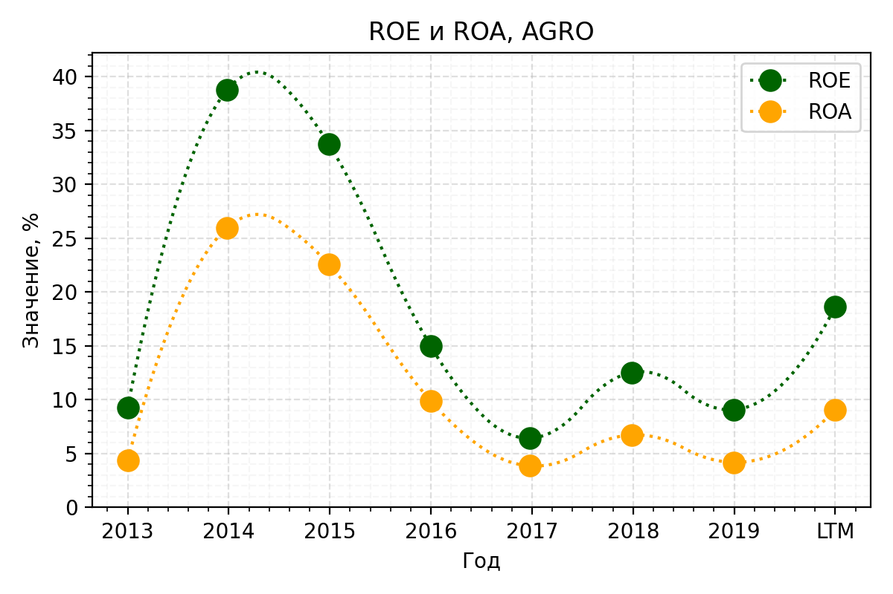
1. **Return on Equity** — характеризует эффективность использования средств акционеров. (Сколько прибыли принес один вложенный акционерами доллар в процентном соотношении.) Чем параметр выше, тем лучше, но ROE меньше 20% считается низким. — *после сверхуспешных 2014 и 2015 гг. показатель кажется низким*
1. **Return on Assets** — коэффициент рентабельности активов, показывающий процентное соотношение чистой прибыли предприятия к его общим активам — *уровень порядка 4-7%*

## Дивидендная политика
> Согласно дивидендной политике, Русагро планирует направлять на выплаты акционерам минимум 25% чистой прибыли по МСФО. Рассчитываем, что выплаты будут происходить 2 раза в год (по полугодиям). Платят обычно от 35 до 50% от прибыли. (согласно [dohod.ru](https://www.dohod.ru/))

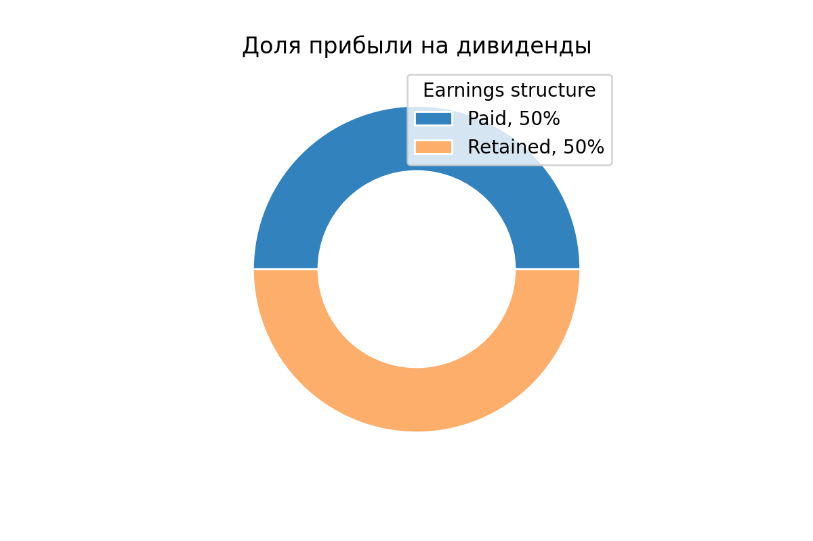
**Payout** — доля прибыли, направленной на дивиденды (обычно норма до 50%) — *здесь 37% за 2020, нормальный показатель*

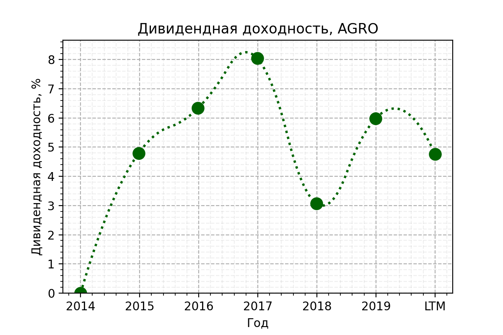
**Дивидендная доходность** — отношение величины годового дивиденда на акцию к цене акции — *доходность выше ставок по депозитам, хорошо*

## Оценка компании (мультипликаторы)

### Капитализация
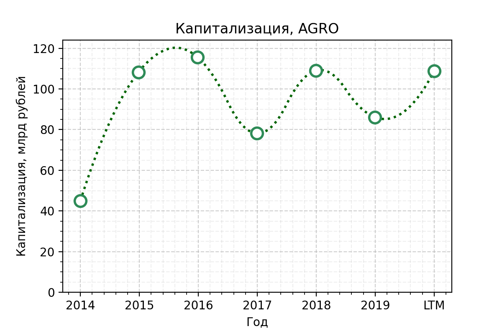
**Капитализация** — стоимость одной акции, умноженная на их количество на бирже. Обычно чем крупнее компания, тем она устойчивее. В малых компаниях нужно адекватно оценивать риск.

### P/E
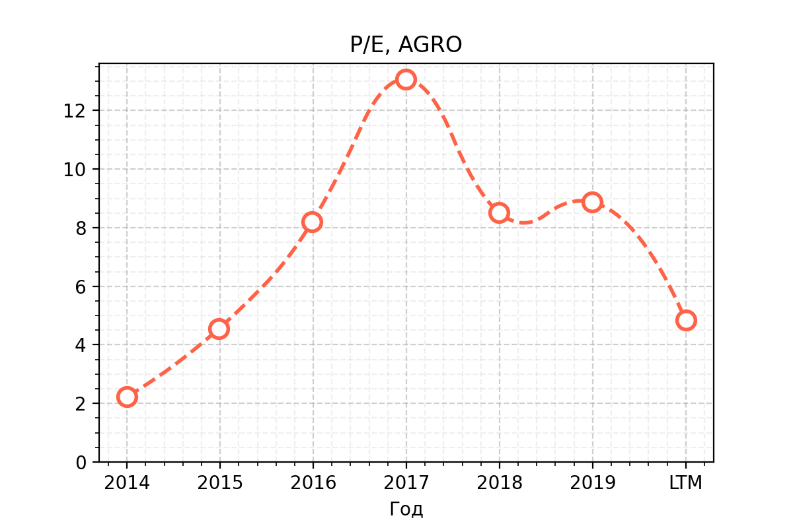
**P / E** — отношение стоимости акции к чистой прибыли компании на одну акцию. Сколько годовых прибылей стоит компания — *видимо этот год будет удачным*

### EV/EBITDA vs Чистый долг/EBITDA
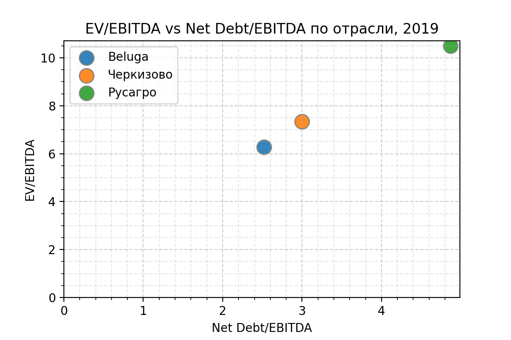
показатели по МСФО 2019 согласно [conomy.ru](https://www.conomy.ru), чем ближе к точке (0, 0), тем лучше — *показатели выше среднего*

### Оценка стоимости акций
Согласно DCF модели, стоимость акций AGRO имеет потенциал к росту. Конкретные цифры можно посмотреть на [conomy.ru](https://www.conomy.ru/emitent/ros-agro-plc/page-templates/3265/7183)

## Вывод
Абсолютно субъекивные ни на что не претендующие итоги:
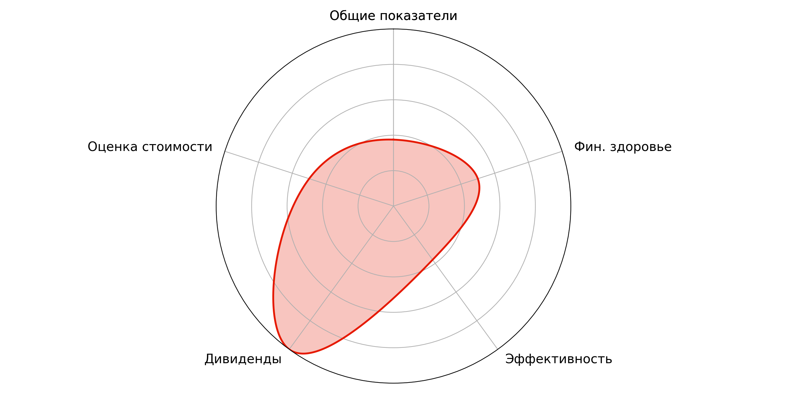

## Источники
1. [Как я анализирую акции перед покупкой (Т—Ж)](https://journal.tinkoff.ru/analiz-emitenta/)
1. [Conomy.ru](https://www.conomy.ru/emitent/ros-agro-plc)
1. [Dohod.ru](https://www.dohod.ru)