**Продовольствие / [Черкизово](https://cherkizovo.com/) (GCHE)**

> Группа «Черкизово» – крупнейший в России производитель мясной продукции, ориентированный на потребителя, входит в число лидеров на рынках мяса птицы, свинины и продуктов мясопереработки. (**сайт Черкизово**)

## Общие показатели

### Выручка и активы

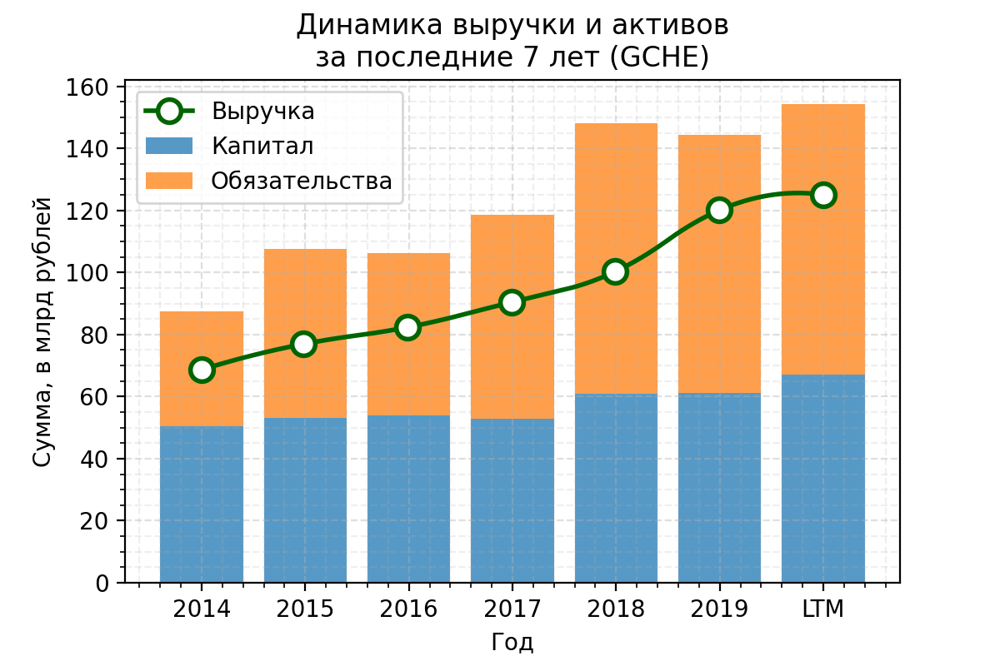
Активы растут, выручка тоже растёт, последние годы уеличилась доля обязательств в активах

### Чистая прибыль и EBITDA
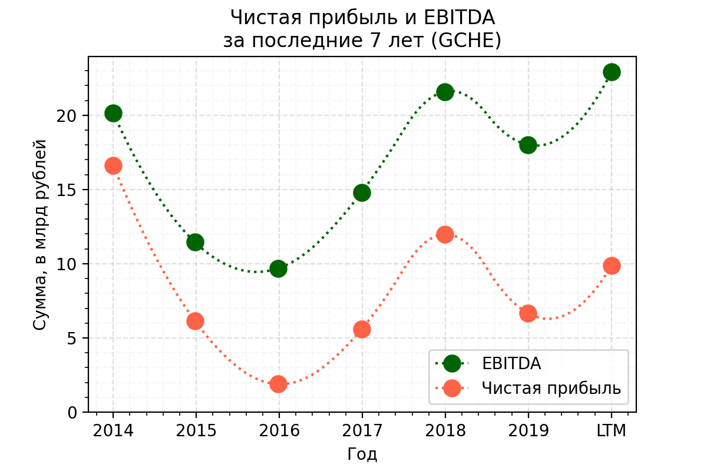
Компания прибыльна, причём за последние 5 лет есть тренд на рост показателей.

### FCF
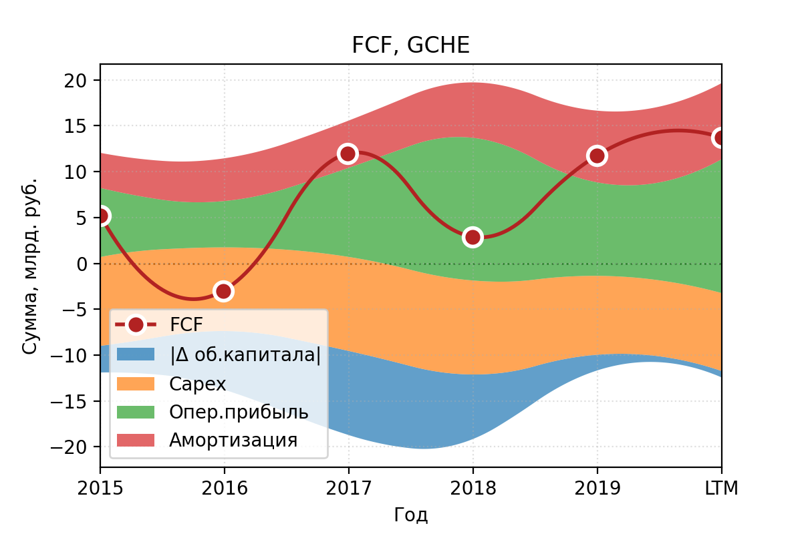
Свободный денежный поток последние несколько лет стабильно положительный, что хорошо.

## Финансовое здоровье
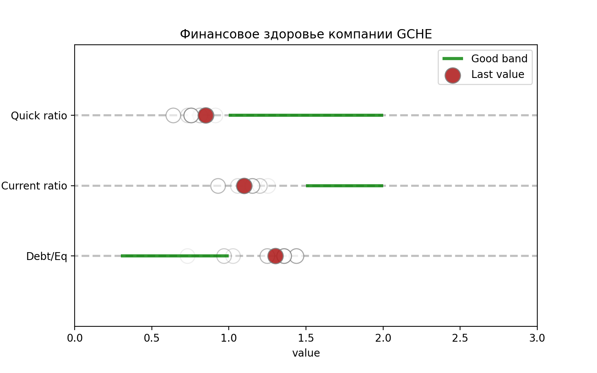
1. **Quick ratio** (коэффициент срочной ликвидности) — cпособность компании погасить краткосрочные обязательства за счет быстрореализуемых активов — *ниже рекомендованого уровня в 1.*
1. **Current ratio** (коэффициент текущей ликвидности) — показывает, как компания может погашать текущие обязательства за счет только оборотных активов — *ниже рекомедуемого диапазона 1.5 - 2.*
1. **Debt / Eq** — соотношение заемных средств к собственному капиталу. Оценивает финансовую устойчивость организации — *выше рекомендованного уровня*

## Эффективность компании

### Чистая рентабельность и валовая маржа
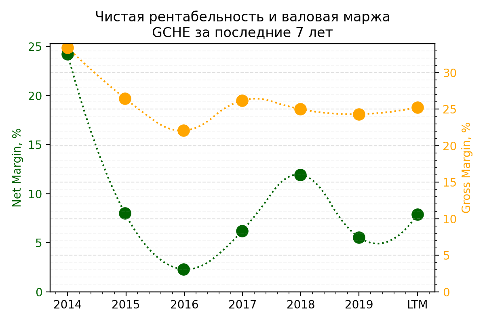
1. **Net Margin** — чистая рентабельность, отношение чистой прибыли к выручке. Если у бизнеса высокая маржинальность, то он более устойчив к падению цен на его продукт или к росту цен на сырье, задействованное в производстве. — *последние 5 лет уровень ниже 15%, хотя в 2014 было 25%*
1. **Gross margin** — валовая маржа, выручка компании за вычетом себестоимости реализованных товаров. Таким образом, чем выше средняя маржа валовой прибыли, тем больше компания сохраняет финансов на каждый рубль продаж, которые она затем может направить для обслуживания других расходов или обязательств — *последние годы показатель держится около 25%*

### ROE, ROA
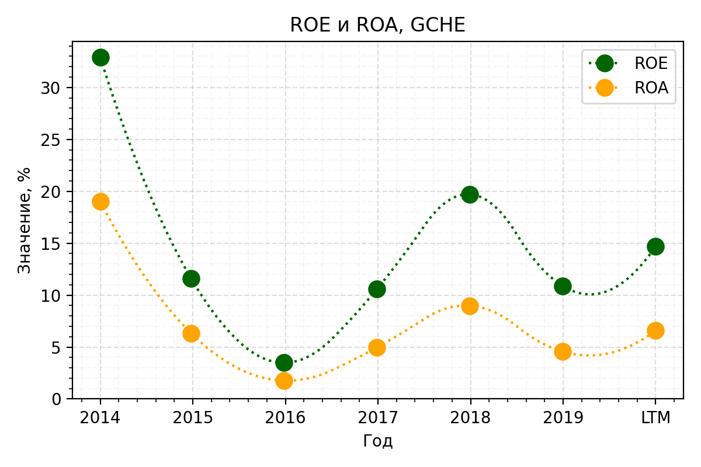
1. **Return on Equity** — характеризует эффективность использования средств акционеров. (Сколько прибыли принес один вложенный акционерами доллар в процентном соотношении.) Чем параметр выше, тем лучше, но ROE меньше 20% считается низким. — *в среднем показатель около 10 - 15%*
1. **Return on Assets** — коэффициент рентабельности активов, показывающий процентное соотношение чистой прибыли предприятия к его общим активам — *последние годы уровень не превышает 10%*

## Дивидендная политика
> Дивидендная политика Черкизово предусматривает выплату не менее 50% от чистой прибыли по МСФО скорректированной на изменение справедливой стоимости биологических активов и с/х продукции, при условии сохранения коэффициента Чистый долг/скорректированная EBITDA < 2,5х в среднесрочной перспективе (прямо сейчас на грани или выше). Как правило, платят больше 50% (60-70%). Обычно платят дважды в год по полугодиям. (согласно [dohod.ru](https://www.dohod.ru/ik/analytics/dividend/gche))

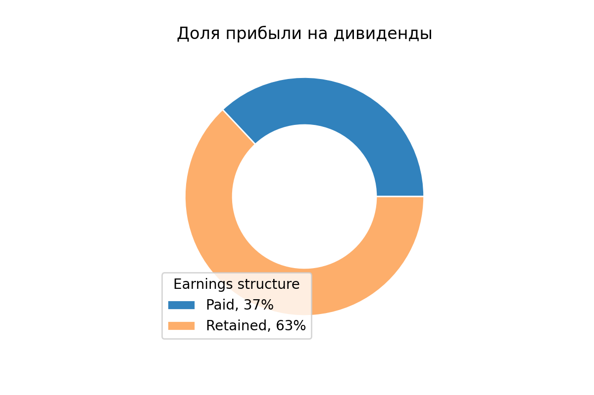
**Payout** — доля прибыли, направленной на дивиденды (обычно норма до 50%) — *здесь 37% за 2020, нормальный показатель*

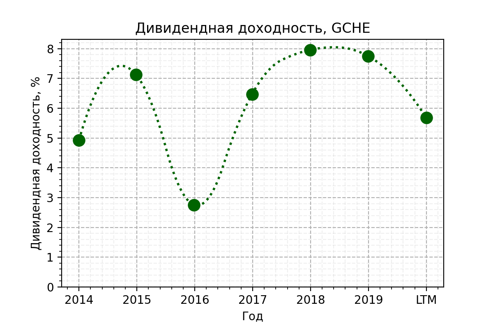
**Дивидендная доходность** — отношение величины годового дивиденда на акцию к цене акции — *доходность выше ставок по депозитам, хорошо*

## Оценка компании (мультипликаторы)

### Капитализация
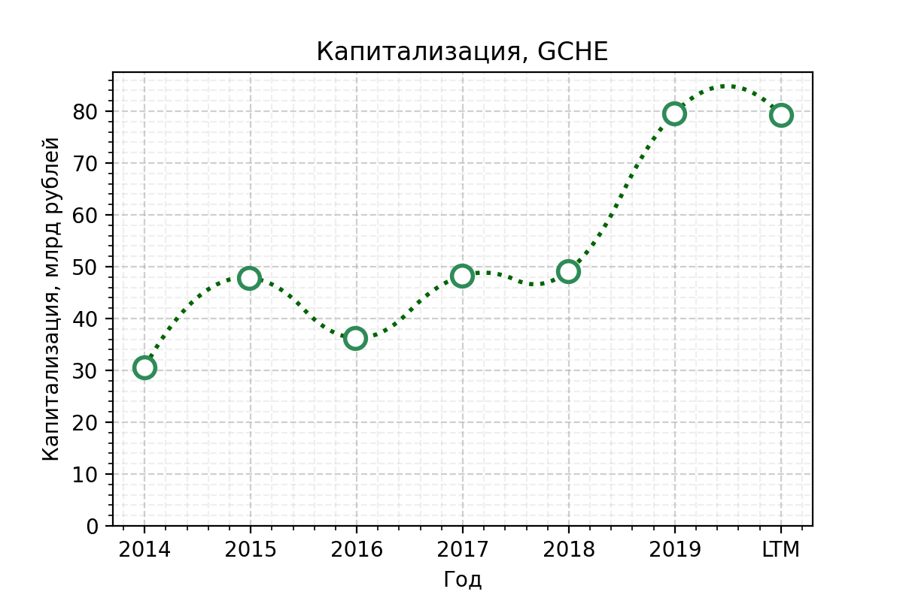
**Капитализация** — стоимость одной акции, умноженная на их количество на бирже. Обычно чем крупнее компания, тем она устойчивее. В малых компаниях нужно адекватно оценивать риск - *компания поменьше того же Русагро*

### P/E
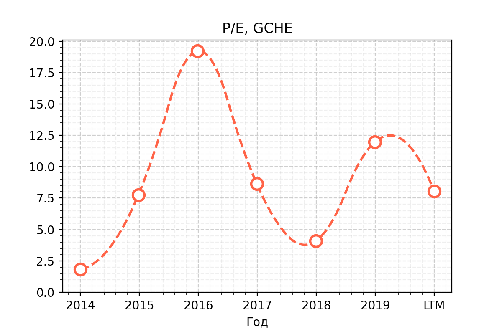
**P / E** — отношение стоимости акции к чистой прибыли компании на одну акцию. Сколько годовых прибылей стоит компания — *довольно сильные колебания, но сейчас относительно неплохо*

### EV/EBITDA vs Чистый долг/EBITDA
можно посмотреть сравнительную картинку в разборе Русагро. 

### Оценка DCF
Согласно DCF модели, GCHE имеет потенциал к росту. Конкретные цифры можно посмотреть на [conomy.ru](https://www.conomy.ru/emitent/gruppa-cherkizovo/page-templates/3265/6952)

## Вывод
Абсолютно субъекивные ни на что не претендующие итоги:
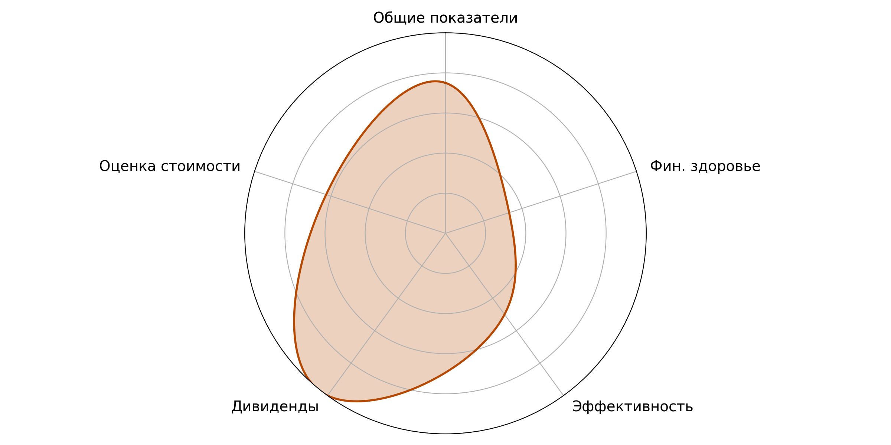

## Источники
1. [Conomy.ru](https://www.conomy.ru/emitent/gruppa-cherkizovo)
1. [Dohod.ru](https://www.dohod.ru/ik/analytics/dividend/agro)