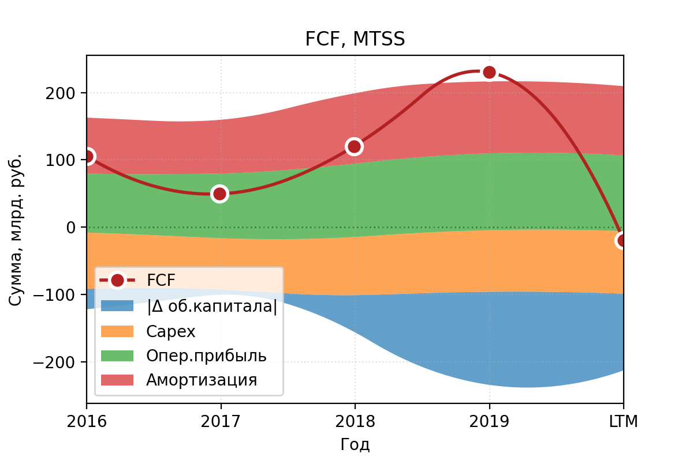

**Телеком / [МТС](https://moskva.mts.ru/about/investoram-i-akcioneram/korporativnoe-upravlenie/raskritie-informacii/godovaya-otchetnost) (MTSS)**

> Публичное акционерное общество «Мобильные ТелеСистемы» (ПАО «МТС») — ведущая компания в России и странах СНГ по предоставлению услуг мобильной и фиксированной связи, доступа в интернет, кабельного и спутникового ТВ-вещания, цифровых сервисов и мобильных приложений, финансовых услуг и сервисов электронной коммерции, а также конвергентных ИТ-решений в сфере системной интеграции, интернета вещей, мониторинга, обработки данных и облачных вычислений. Предоставляя инновационные услуги и решения, МТС вносит значимый вклад в экономический рост и улучшение качества жизни десятков миллионов людей в странах присутствия. (**сайт  [МТС](https://moskva.mts.ru/about/informaciya-o-mts/mts-v-rossii-i-v-mire/o-kompanii/informaciya-o-mts)**)

## Общие показатели

### Выручка и активы

Из графика видна высокая доля обязательств, а также довольно стабильная выручка за последние 5 лет (немного даже растёт). 
Основная доля в структуре выручки согласно МСФО 2019 - услуги мобильной и фиксированной связи.

### Чистая прибыль и EBITDA

Прибыль довольно держится стабильно на одном уровне, положительная, уже хорошо.

### FCF

Денежный поток также довольно приличный, положительные последние годы.

## Финансовое здоровье

1. **Quick ratio** (коэффициент срочной ликвидности) — cпособность компании погасить краткосрочные обязательства за счет быстрореализуемых активов — *ниже рекомендованого уровня в 1.*
1. **Current ratio** (коэффициент текущей ликвидности) — показывает, как компания может погашать текущие обязательства за счет только оборотных активов — *ниже рекомедуемого диапазона 1.5 - 2.*
1. **Debt / Eq** — соотношение заемных средств к собственному капиталу. Оценивает финансовую устойчивость организации — *намного выше рекомендованного уровня (точка даже не попала в диапазон) из-за большой доли обязательств*

## Эффективность компании

### Чистая рентабельность и валовая маржа

1. **Net Margin** — чистая рентабельность, отношение чистой прибыли к выручке. Если у бизнеса высокая маржинальность, то он более устойчив к падению цен на его продукт или к росту цен на сырье, задействованное в производстве. — *стабильно выше 10%, наверное можно считать достоинством*
1. **Gross margin** — валовая маржа, выручка компании за вычетом себестоимости реализованных товаров. Таким образом, чем выше средняя маржа валовой прибыли, тем больше компания сохраняет финансов на каждый рубль продаж, которые она затем может направить для обслуживания других расходов или обязательств — *стабильный уровень*

### ROE, ROA

1. **Return on Equity** — характеризует эффективность использования средств акционеров. (Сколько прибыли принес один вложенный акционерами доллар в процентном соотношении.) Чем параметр выше, тем лучше, но ROE меньше 20% считается низким. — *запредельный ROE из-за большой доли обязательств*
1. **Return on Assets** — коэффициент рентабельности активов, показывающий процентное соотношение чистой прибыли предприятия к его общим активам — *ROA в принципе хорош, порядка 10%, выше некоторых других телекомов*

## Дивидендная политика
> В марте 2019 года приняли новую дивидендную политику, которая предполагает выплаты в размере 28 руб. на акцию по итогам 2019-2022 г. Прошлая дивидендная политика предполагала выплату в размере 25-26 рублей на акцию. Обычно платят дважды в год (в июле - около 70% общего объема и октябре - около 30%). В 2019 году осуществили продажу украинского подразделения и часть средств направили на выплату спецдивидендов в январе 2020 года. (согласно [dohod.ru](https://www.dohod.ru/ik/analytics/dividend/mtss))

**Payout** — доля прибыли, направленной на дивиденды (обычно норма до 50%) — *payout высоковат*

**Дивидендная доходность** — отношение величины годового дивиденда на акцию к цене акции — *дивидендная доходность на уровне 10%, хорошо*

## Оценка компании (мультипликаторы)

### Капитализация

**Капитализация** — стоимость одной акции, умноженная на их количество на бирже. Обычно чем крупнее компания, тем она устойчивее. В малых компаниях нужно адекватно оценивать риск - **

### P/E

**P / E** — отношение стоимости акции к чистой прибыли компании на одну акцию. Сколько годовых прибылей стоит компания — *последний PE сравним со средним по России и намного ниже среднего PE по европейским телекомам*

### EV/EBITDA vs Чистый долг/EBITDA

### Оценка DCF
Согласно DCF модели, MTSS имеет потенциал к росту. Конкретные цифры можно посмотреть на [conomy.ru](https://www.conomy.ru/emitent/mts-mobilnye-telesistemy/page-templates/3265/7026)

### Развитие
Согласно [стратегии CLV 2.0](https://moskva.mts.ru/about/informaciya-o-mts/mts-v-rossii-i-v-mire/o-kompanii/missiya-i-strategiya) на 2020-2022:

* улучшение клиентского опыта через иск.интеллект, аналитику данных и т.п.
* повышение лояльности к бренду, развитие долгострочных взаимоотношений с клиентами
* развитие экосистемы и т.д.

## Вывод
Абсолютно субъекивные ни на что не претендующие итоги:

## Источники
1. [Отчётность МТС](https://moskva.mts.ru/about/investoram-i-akcioneram/korporativnoe-upravlenie/raskritie-informacii/godovaya-otchetnost)
1. [Интерактивный отчёт МТС 2019](http://ar2019.mts.ru/ru)
1. [Conomy.ru](https://www.conomy.ru/emitent/mts-mobilnye-telesistemy)
1. [Dohod.ru](https://www.dohod.ru/ik/analytics/dividend/mtss)