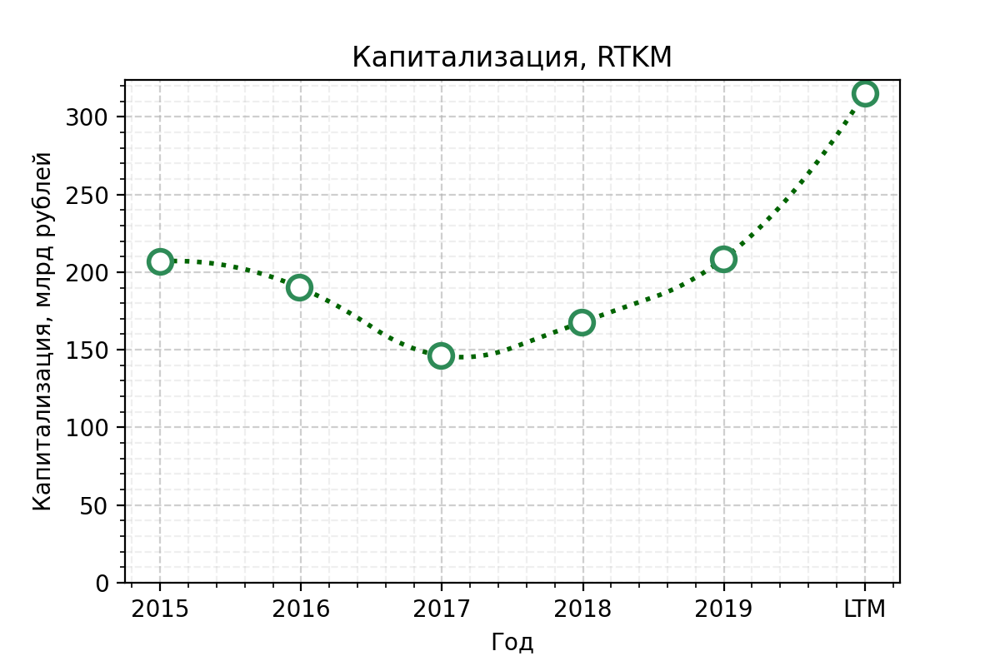

**Телеком / [Ростелеком](https://www.company.rt.ru/ir/) (RTKM)**

> ПАО «Ростелеком» — крупнейший в России интегрированный провайдер цифровых услуг и решений <...>. 
> Компания занимает лидирующие позиции на рынке услуг высокоскоростного доступа в интернет и платного телевидения. Количество абонентов услуг ШПД превышает 13,4 млн, платного ТВ «Ростелекома» — 10,7 млн пользователей, из них свыше 5,9 млн подключено к услуге «Интерактивное ТВ». Дочерняя компания «Ростелекома» оператор Tele2 Россия является крупным игроком на рынке мобильной связи, обслуживающим более 44 млн абонентов и лидирующим по <...> готовности пользователей рекомендовать услуги компании. (**сайт  [Ростелеком](https://www.company.rt.ru/about/info/)**)

## Общие показатели

### Выручка и активы

Выручка стабильна генерируется, и даже растёт, однако ниже чем у конкурента МТС (при сопоставимых активах). Доля капитала в активах упала.
Ростелеком приобрёл Tele2 Россия, поэтому данные могут быть пересмотрены и это скорее всего окажет заметное влияние на выручку.

В [структуре выручки](https://www.company.rt.ru/ir/results_and_presentations/presentations/2020-11_Investor_presentation_RU.pdf) за 9 месяцев 2020 максимальную часть 34% занимает мобильная связь, далее 17% - фиксированный ШПД, затем цифровые сервисы, ТВ и т.д.

### Чистая прибыль и EBITDA

Прибыль есть, уже хорошо, нет убыточных периодов.

### FCF

FCF колеблется относительно нуля, сложно что-то сказать. Можно отметить, что capex увеличился за последние 5 лет.

## Финансовое здоровье

1. **Quick ratio** (коэффициент срочной ликвидности) — cпособность компании погасить краткосрочные обязательства за счет быстрореализуемых активов — *ниже рекомендованого уровня в 1.*
1. **Current ratio** (коэффициент текущей ликвидности) — показывает, как компания может погашать текущие обязательства за счет только оборотных активов — *ниже рекомедуемого диапазона 1.5 - 2.*
1. **Debt / Eq** — соотношение заемных средств к собственному капиталу. Оценивает финансовую устойчивость организации — *намного выше рекомендованного уровня (точка не попала на рисунок) из-за большой доли обязательств*

## Эффективность компании

### Чистая рентабельность и валовая маржа

1. **Net Margin** — чистая рентабельность, отношение чистой прибыли к выручке. Если у бизнеса высокая маржинальность, то он более устойчив к падению цен на его продукт или к росту цен на сырье, задействованное в производстве. — *около 4-6%, тогда как у МТС - выше 10%*

### ROE, ROA

1. **Return on Equity** — характеризует эффективность использования средств акционеров. (Сколько прибыли принес один вложенный акционерами доллар в процентном соотношении.) Чем параметр выше, тем лучше, но ROE меньше 20% считается низким. — *в последний год показатель улучшился из-за уменьшения капитала*
1. **Return on Assets** — коэффициент рентабельности активов, показывающий процентное соотношение чистой прибыли предприятия к его общим активам — *ROA на уровне 2%, низковато (ROA по индустрии согласно [simplywall.st](https://simplywall.st/stocks/ru/telecom/mcx-rtkm/rostelecom-shares) составляет 5.7%)*

## Дивидендная политика
> <...> В марте 2018 года обновили дивидендную политику: будут выплачивать не менее 75% свободного денежного потока по обыкновенным и привилегированным акциям; не менее 5 рублей на одну обыкновенную акцию. В апреле 2019 года приняли решение в расчет СДП включить субсидии от государства под инвестиционные проекты. Cумма дивидендов ограничена чистой прибылью «Ростелекома» по МСФО. С 2020 года планируют вернуться к выплатам дважды в год. Последние годы платят одинаковый размер дивидендов по обычке и по префам. (согласно [dohod.ru](https://www.dohod.ru/ik/analytics/dividend/rtkm))

**Payout** — доля прибыли, направленной на дивиденды (обычно норма до 50%) — *payout высоковат*

**Дивидендная доходность** — отношение величины годового дивиденда на акцию к цене акции — *дивидендная доходность последние пару лет ниже 6%, немного*

## Оценка компании (мультипликаторы)

### Капитализация

**Капитализация** — стоимость одной акции, умноженная на их количество на бирже. Обычно чем крупнее компания, тем она устойчивее. В малых компаниях нужно адекватно оценивать риск - *капитализация последние годы растёт*

### P/E

**P / E** — отношение стоимости акции к чистой прибыли компании на одну акцию. Сколько годовых прибылей стоит компания — *последний PE сравним чуть ниже среднего по российским телекомам и выше среднего по российскому рынку*

### EV/EBITDA vs Чистый долг/EBITDA
согласно данным [conomy.ru](https://www.conomy.ru/telecom-com-rk-vert)

### Оценка DCF
Согласно [conomy.ru](https://www.conomy.ru/emitent/rostelekom/page-templates/3265/7013) Ростелеком имеет потенциал к росту.

### Стратегия развития
Согласно [стратегии развития 2018-2022](https://www.company.rt.ru/about/strategy/) Ростелеком планирует продолжить превращение «из телеком оператора в цифрового партнера населения, бизнеса и государства», в т.ч.:
* развивать экосистемы продуктов, услуг и клиентского сервиса
* модернизировать технологическую платформу
* развивать человеческий капитал
* повышать эффективность

## Вывод
Абсолютно субъекивные ни на что не претендующие итоги:

## Источники
1. [МСФО отчётность Ростелеком](https://www.company.rt.ru/ir/results_and_presentations/financials/IFRS/2020/3/)
1. [Карточка Ростелеком на conomy.ru](https://www.conomy.ru/emitent/rostelekom)
1. [Ростелеком на dohod.ru](https://www.dohod.ru/ik/analytics/dividend/rtkm)
1. [Ростелеком на simplywall.st](https://simplywall.st/stocks/ru/telecom/mcx-rtkm/rostelecom-shares)