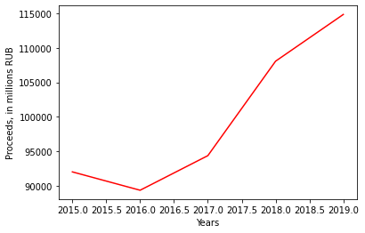
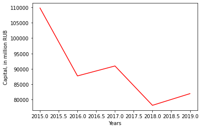
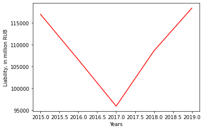
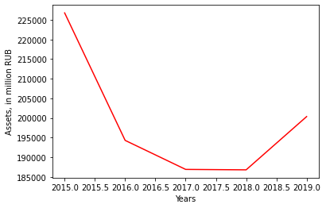
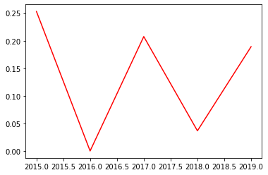
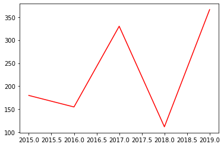
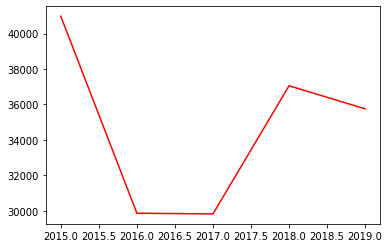

# Хим. индустрия / Акрон

### Динамика выручки и капитала

Выручка компании растёт, однако при этом капитал падает. Возможно, производство компании стало гораздо эффективнее при меньшем используемом имуществе. Или посредством продажи части капитала компания оплачивает свои долги? Сами по себе данные показатели без привлечения других мало говорят в пользу данной компании.

### Динамика обязательств

Обязательства компании Акрон остались практически на том же уровне, на каком были пять лет назад. Сохранение обязательств при уменьшении имущества вряд ли говорит в пользу данной компании.

### ROA
Данные в отчётах по МСФО не найдены.

### Активы

Спад активов компании идёт вслед за спадом капитала компании, что так же не говорит в пользу данной компании.

### Выручка / Чистая прибыль

Поведение отношения выручки к чистой прибыли несёт колебательный характер. Среднее значение за пять последних лет не превышает 25%, что, однако, не лучше, чем соответствующий показатель у компании УралКалий.
________

### Дивиденды

В том или ином виде компания платит дивиденды втечение последних пяти лет. Но это единственное видимое преимущество перед компанией УралКалий, которая дивиденды не выплачивала за 2015-2019 годы. Возможно, это последний способ привлечь инвесторов?
### Стоимость компании (капитализация)
Данные в отчётах по МСФО не обнаружены.

### Стоимость акций
Данные в отчётах по МСФО не обнаружены.

# Вывод
Из данных двух компанийв плане инвестиций более предпочтительна компания УралКалий ввиду роста активов, капитала и снижения обязательств, которые указывают на её дальнейший рост. Данные показатели имеют противоположный характер поведения у компании-оппонента Акрон, которая, видимо, прекращает свой рост, не смотря на то, что платит дивиденды.
______

## Мультипликаторы

### P/E

### EV

### EBITDA

Характер показателя - не растущий.
