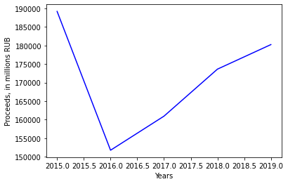
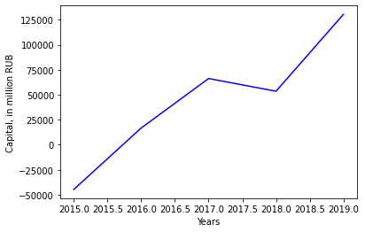
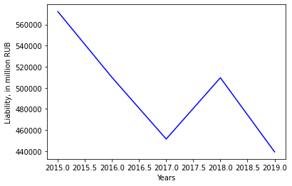
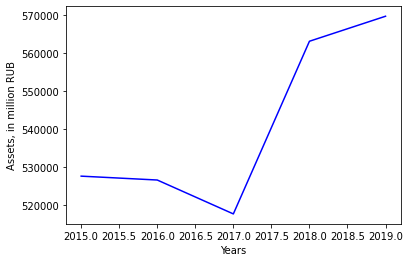
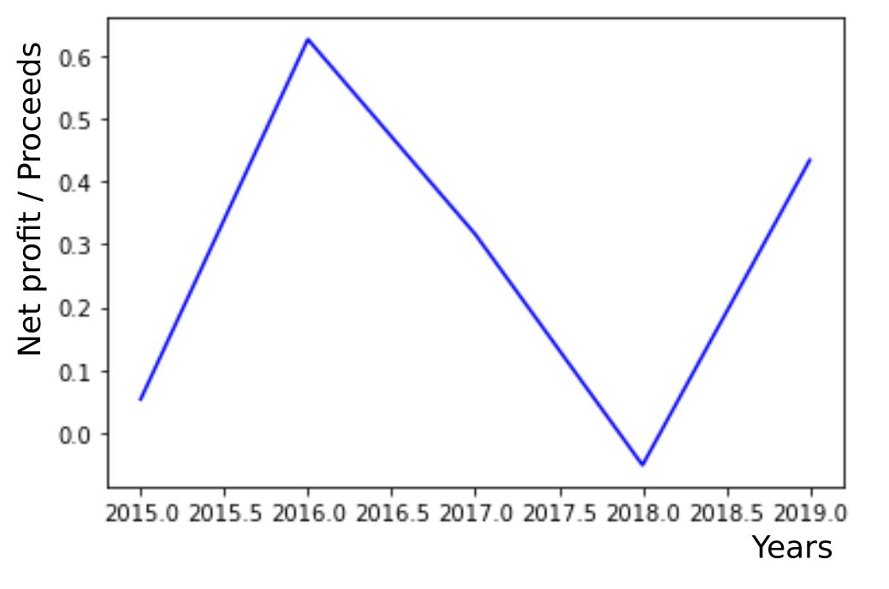

# Хим. индустрия (удобрения) / УралКалий

### Динамика выручки и капитала

Рост капитала омрачается резким спадом выручки. Однако, согласно соответствующему отчёту по МСФО за 2016 год, падение выручки обусловлено усилением курса рубля по отношению к доллару и евро (около 80% удобрений, производимых компанией, идёт на экспорт). Если на выручке отразилось только влияние изменения курса валют, то последующий рост выручки является признаком, как минимум, стабильности ведущихся дел в компании. 

### Динамика обязательств

Не растущие обязательства вряд ли приведут компанию в трясину долгов. С другой стороны, снижение размера обязательств может указывать на снижение скорости раширения компании. Однако, обращая внимание на рост капитала компании, можно сделать кардинально противоположный вывод - компания способна расти более за счёт своих средств, нежели благодаря опоре на кредиты.

### ROA
Данные в отчёте по МСФО компании не предоставлены.
### Активы

Характер активов - не убывающий за последние 5 лет. Внятного объяснения спада в 2017 году в соответствующем отчёте по МСФО не найдено. Однако последующий рост активов, рост капитала компании и спад обязательств последней характерезует УралКалий как растущий бизнес.

### Чистая прибыль / Выручка

Колебательный характер поведения отношения чистой прибыли компании к её выручке создаёт трудности в оценке компании УралКалий. Средний показатель за 5 лет составляет примерно 0.3 - то есть в среднем  за 5 лет 30% выручки компании переходило в чистую прибыль. Данное число само по себе, с учётом характера поведения отношения, ничего не говорит. Его необходимо сравнить с соответствующим показателем для компании Акрон.
________

### Дивиденды
Дивиденды компанией УралКалий на протяжении последних 5 лет не выплачивались. Данные сведения могут говорить в пользу дальнейшего роста компании с учётом поведения её капитала, обязательств и активов, рассмотренных ранее.

### Стоимость компании (капитализация)

Данные в отчётах по МСФО не найдены.

### Стоимость акций

Данные в отчётах по МСФО не найдены.

# Вывод

Рост активов, капитала и спад обязательств компании говорит в пользу роста последней. Однако поведение отношения чистой прибыли к капиталу имело колебательный характер поведения за последние пять лет,что усложняет оценку компаний. Более того, данное поведение не говорит в пользу самой компании. Тем не менее, среднее занчение в 30% этого отношения за пять последний лет можно сравнить с соответствующим значением компании Акрон.

## Мультипликаторы

Данные о мультипликаторах в отчётах по МСФО компании Уралкалий не предоставлены.

### P/E

### EV

### EBITDA
