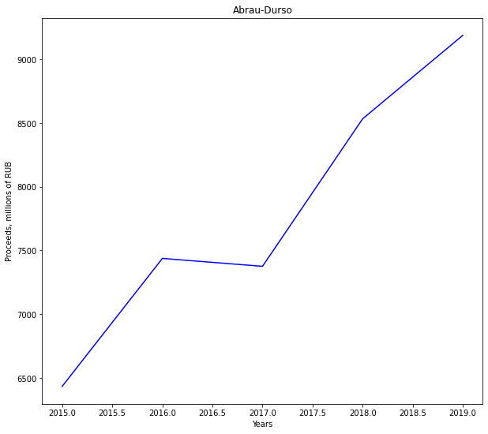
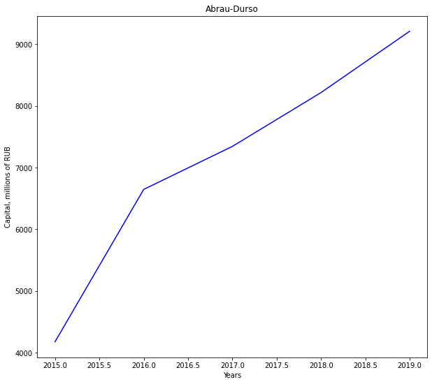
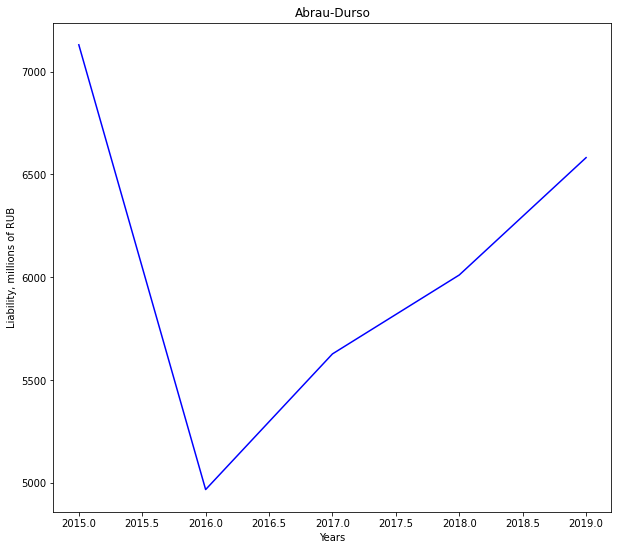
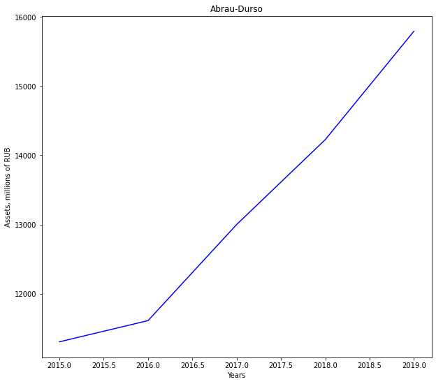
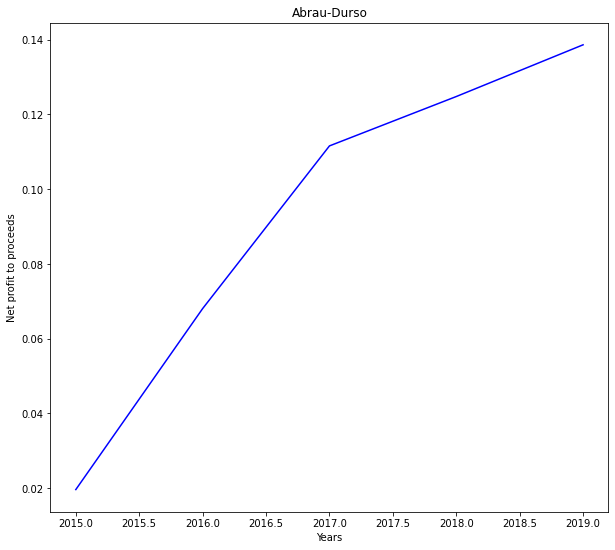
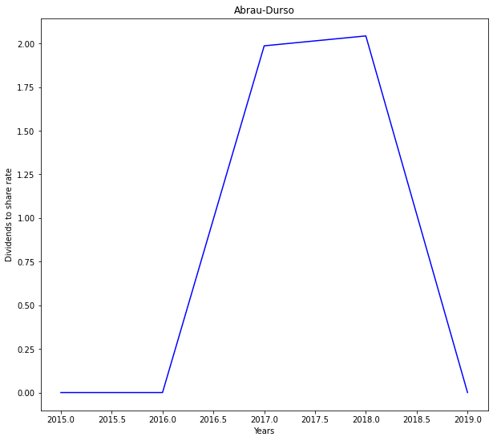
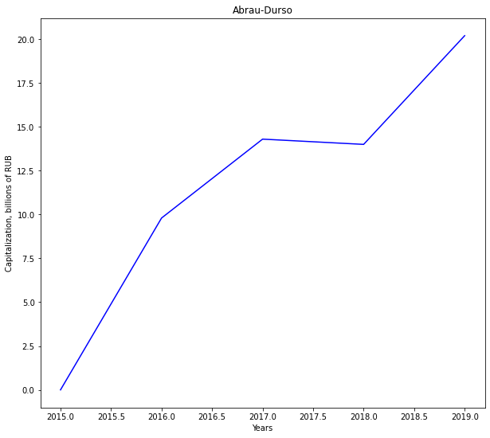
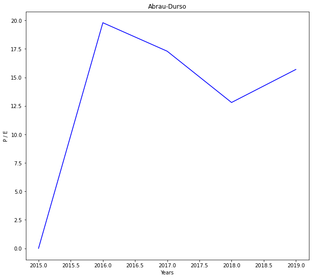
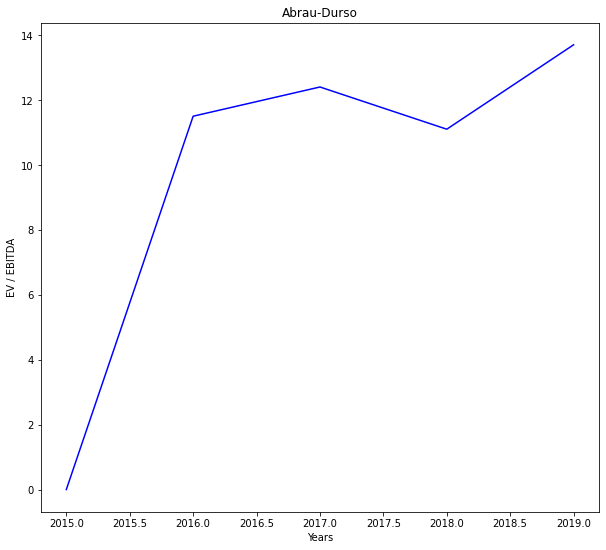

# Алкогольная промышленность / Компания

### Динамика выручки и капитала

Рост капитала и выручки компании более чем в 1,5 раза - положительный показатель: компания растёт как на рынке и в производстве, так и в выручаемых средствах.
### Динамика обязательств

Суммарные обязательства компании за последние 5 лет не выросли, в целом не превышая имеющийся капитал компании, что может говорить в пользу устойчивости компании к банкротству. Согласно последнему отчёту по МСФО за 2019 год у компании нет и не ожидается судебных разбирательств в ближайшее время. 
### Активы

Активы компании устойчиво растут (примерно в 1,6 раза за последние 5 лет), что положительно характеризует компанию.

###  Чистая прибыль / Выручка

Отношение чистой прибыли компании к выручке последней представляет собой интерес: данное отношение выросло в 7 раз при том, что сама по себе выручка выросла примерно в 1,5 раза. Согласно соответствующим отчётам, за пятилетний период упала себестоимость покупной продукции (практически в 5 раз), а так же упали коммерческие расходы (практически в 2 раза), основная статья в которых - реклама и маркетинг (вложения в рекламу и маркетинг упали практически в 10 раз). Возможно это говорит о достаточной известности и популярности компании, так что Абрау Дюрсо не нуждается в массовом представлении. 
________

### Дивиденды / Цена акций

По графику видно, что компания в портфеле точно не будет представлять дивидендную группу, однако, согласно предыдущим показателям, может представлять собой хороший бизнес для продажи в будущем. Акции за пятилетний период выросли в стоимости примерно в 2,5 раза. 

### Стоимость компании (капитализация)

Стоимость компании растёт.

## Мультипликаторы

### P/E

Данное отношение не убывает втечение последних 5 лет, что может говорить о переоценённости компании. Для дальнейших выводов требуется сравнение с другой компании из алкогольной промышленности.

### EV / EBITDA

Показатель не убывает за последние 5 лет. Необходимо сравнивать с другими компаниями из алкогольной промышленности.

# Вывод

Компания представляет собой устойчиво растущий бизнес, который не нуждается в широком представлении потенциальным потребителям. Текущие и прошлые обязательства компании в сравнении с имеющимся капиталом демонстрируют её возможность пережить финансовые потрясения. Рост цен на акции компании в 2,5 раза и показатели бизнеса характеризуют компанию как возможное ценное приобритение в портфеле. Однако компания не может стать представителем дивидендной секции - отношение выплаченных дивидендов к цене акции составляет примерно 2%, что даже ниже ставки по вкладу в банке.
______

