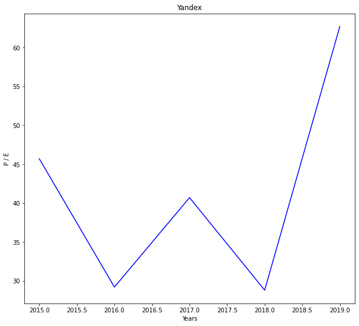

# IT-сфера / Яндекс

### Динамика выручки и капитала

Наблюдается монотонный рост выручки и капитала компании за последние 5 лет не менее чем в 3 раза. В случае Яндекса капитал представлен акционерным капиталом. Данный капитал образуется за счёт продажи и эммисси акций. Рост акционерного капитала говорит о возможной заинтересованности (к тому же, растущей) инвесторов в акциях компании Яндекс за прошедший 5-летний период. 

### Динамика обязательств

Обязательства компании растут со временем, но никогда не превосходят имеющийся у компании капитал. На данный момент капитал компании превосходит её текущие обязательства более чем в 3 раза.

### Активы

Активы компании выросли примерно в 3 раза за прошедший 5-летний период. 

###  Чистая прибыль / Выручка

Отношение чистой прибыли к выручке со временем падает. Подробное рассмотрение статей расходов компании выявляет рост административно-хозяйственных расходов и расходов, связанных с себестоимостью продаж более чем в 1.5 раза в 2019 году по сравнению с 2018 годом. Рост данных расходов может говорить о росте самой компании (административно-хозяйственные расходы  - расширение штата сотрудников, приобретение нового оборудования, расходы на себестоимость продаж - повышение зарплат сотрудников, использование более качественной аппаратуры). 

________

### Дивиденды / Цена акций

Компания не вылачивала дивиденды по своим акциям за последний 5-летний период. Цена же самих акций компании выросла примерно в 3 раза. 

### Стоимость компании (капитализация)

С ростом цен на акции компании растёт же и стоимость самой компании.

## Мультипликаторы

### P/E

Данный показатель имеет сложное поведение, при этом его величина заметно больше единицы, что говорит о переоценённости компании.

### EV / EBITDA

Показатель имее сложное поведение. Необходимо сравнивать с другими компаниями из IT-сферы.  Данный показатель примерно в 2 раза меньше предыдущего посезонно, однако тоже больше единицы, что говорит о дороговизне компании (для покрытия стоимости компании понадобится более 1 чистой прибыли).

# Вывод

Компания Яндекс однозначно умеет зарабатывать деньги согласно динамике выручки. Акции компании пользуются спросом (согласно поведению акционерного капитала, цен на акции, капитализации компании).  Возможно сама компания растёт и захватывает всё большие зоны влияния на рынке (согласно интерпретации характера изменения обязательств компании и отношения чистой прибыли к выручке). Сложно судить о возможных последствиях разорения компании при наличии данных только об акционерном капитале компании. На данный момент компания представляется переоценнённой, но, согласно динамике показателей капитала, выручки, а так же принимая во внимание возможное расширение компании на рынке, компания Яндекс представляет собой привлекательный объект инвестирования. 
______

